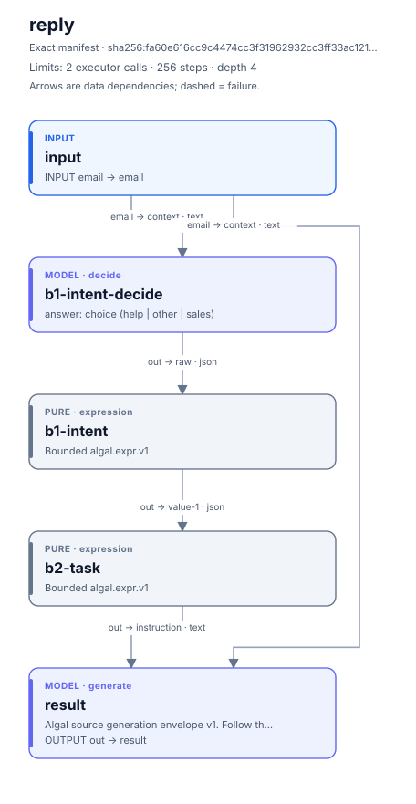
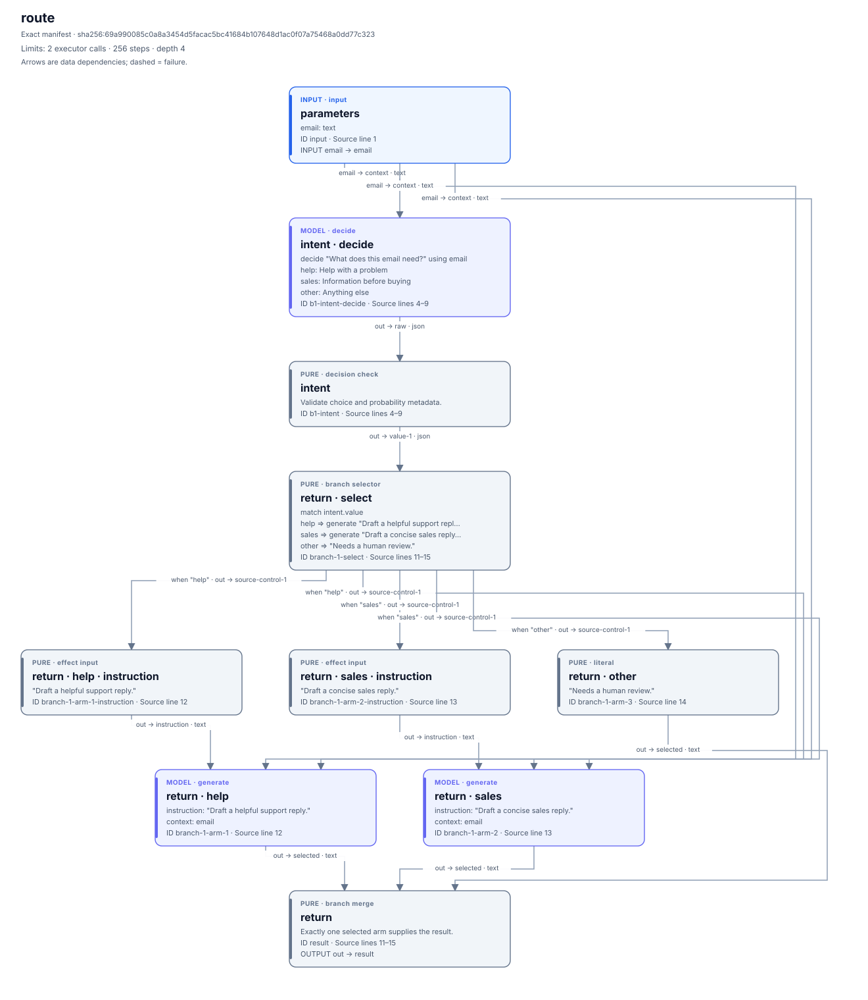
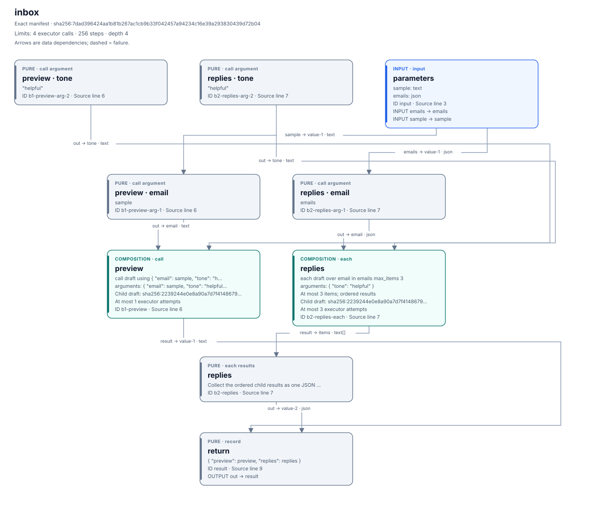
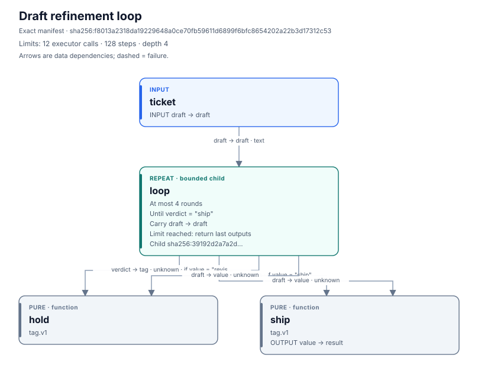
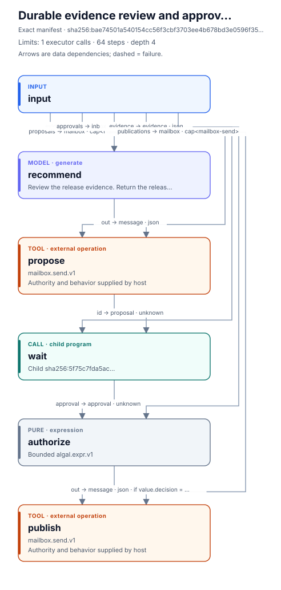
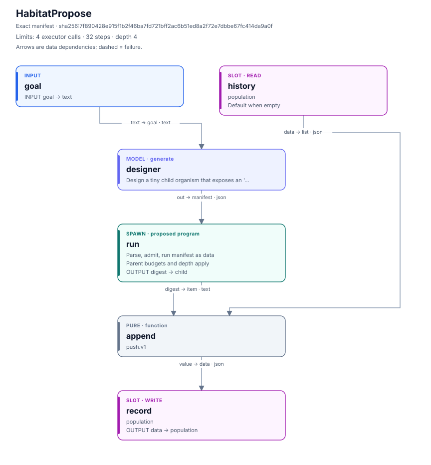

# ALGAL

**Agent work that survives a pause—and comes back with evidence.**

ALGAL is a language and application VM for bounded agent programs. Use it when
an AI-assisted task needs to wait for a person, survive a CLI restart, reuse
completed work, or explain what happened without calling the model again.
The host chooses the tools and authority; the program makes decisions, limits,
and approval points explicit. A native Rust CLI and an independently runnable
Bun runtime share the program, receipt, and durable process contracts.

## Pick the job you need done

| Your job | What ALGAL retains | Start here |
| --- | --- | --- |
| Review a change brief now; approve the exact local report later | Evidence, proposal, human decision, and publication history across separate invocations | [Native workbench](docs/native-workbench.md); optional [on-device Apple brief](docs/apple-brief.md) |
| Turn a coding attempt into a checked patch | Admitted source revision, proposed patch, host-selected test results, and unresolved operation custody | [Durable repairs](docs/repair.md) |
| Give another reviewer a verifiable execution history | One portable evidence file that replays without your store, credentials, or model | [Offline evidence](docs/vm.md#verify-a-process-away-from-its-original-host) |
| Route support requests and reuse a draft helper over a bounded inbox | Explicit context, selected branches, child program identities, and recorded results | [Readable programs](#read-the-program-see-its-structure) and [reuse](#write-a-program-once-call-it-or-use-it-for-each-item) |
| Observe a PR until checks settle, without spending model calls on polling | Exact Git revision and policy evidence, bounded waits, and a review or repair packet | [Read-only PR shepherd](docs/pr-shepherd.md) |

The [use-case guide](docs/use-cases.md) connects each job to runnable commands,
expected artifacts, and the work your host still owns. Start with the packaged
VM below; author a custom program once the retained workflow is useful to you.

## Try the VM with one executable

[Download and verify the native prerelease](docs/native-release.md)
([published packages](https://github.com/hraness/algal/releases)).
The workbench needs no Bun, Cargo, checkout, credentials, or web server.
Use fresh output directories:

```sh
algal doctor
algal demo start ./my-review
algal demo inspect ./my-review
algal demo prove ./crash-laboratory
```

Open `my-review/report.html`. Review the retained proposal and copy its exact
approve or deny command into a later terminal invocation. Approval publishes
that proposal locally; denial completes without publication. Repeating the same
decision preserves the completed VM head and creates no second publication.
For your own small JSON evidence, add `--evidence ./checks.json` to `demo start`.

`crash-laboratory/proof.json` records actual owned-process SIGKILL tests: recover
an interrupted read without repeating the completed prefix write, and stop
before redispatching an uncertain write. It also checks approval, denial, and
offline verification after moving the source store away. These default demos
use **deterministic decision fixtures**; their durable state, journals, recovery,
and verification are real. They do not evaluate live model quality.

On a compatible Mac, the optional [private change brief](docs/apple-brief.md)
uses **one real on-device Apple model request** to draft from your supplied
evidence. It requires the separate Apple bridge and Python demo harness. The
workflow then waits for exact human approval; continuation admits no model
executor and reuses the retained result. The generated prose still needs review.

### What makes this useful

The unit of work is a saved, typed program plus its recorded execution. A wait
does not require keeping a model conversation alive. A restart can reuse settled
effects. A reviewer can check a portable history offline. The same program can
run in the native kernel or the Bun reference runtime, and the cross-runtime
demo resumes each runtime's saved work in the other on a shared local store.

Efficiency comes from explicit context, bounded selected paths, retained effects,
and model-free waiting and verification. The demos measure those operations;
they do not establish token, cost, or latency savings against other engines.

### Adoption boundary

This is working **prerelease software for bounded, host-owned workflows**.
Native packages are unsigned and unnotarized. ALGAL is an application VM, not
an OS sandbox; host tools retain their host permissions. Coding jobs and the
PR shepherd currently use the Bun host. There is no multi-tenant service,
distributed custody, global storage quota, or retention service. Unknown writes
require reconciliation, and a verifying receipt proves execution consistency,
not factual truth or exactly-once arbitrary external effects. See the
[operating boundary](docs/use-cases.md#choose-the-right-boundary) before deployment.

## Read the program. See its structure.

This is executable `.algal` source. It makes one typed decision, selects an
instruction with ordinary logic, and generates a draft reply.

<!-- source-example:start -->

```algal
program reply(email: text) -> text {
  budget { max_agent_calls: 2 }

  let intent = decide "What does this email need?" using email
    as choice {
      help: "Help with a problem",
      sales: "Information before buying",
      other: "Anything else"
    }

  let task = match intent.value {
    help => "Draft a helpful support reply.",
    sales => "Draft a concise sales reply.",
    other => "Draft a clarifying question."
  }

  return generate task using email
}
```

<!-- source-example:end -->



The diagram is generated from the compiled manifest, including the pure check
that validates the decision before a branch uses it. `decide` and `generate`
are effects; `match` is pure. `using` declares the context each effect receives.
The budget counts executor attempts, including retries; in this program they
are exactly the decision and generation calls. The wider runtime counter also
covers gates and recall operations, while tool calls are separate.

### Try it without credentials

From a checkout, with Bun 1.3 or newer:

```sh
bun install --frozen-lockfile
bun cli.ts compile examples/source/reply.algal --out reply.algal.json --source-map reply.map.json
bun cli.ts check examples/source/reply.algal
bun cli.ts diagram examples/source/reply.algal --format svg --out reply.svg

# Scripted answers demonstrate orchestration, not live model quality.
bun cli.ts run examples/source/reply.algal \
  --args examples/source/reply.args.json \
  --responses examples/source/reply.responses.json > reply.receipt.json
bun cli.ts verify reply.receipt.json examples/source/reply.algal
bun cli.ts diagram examples/source/reply.algal \
  --receipt reply.receipt.json --format svg --out reply-run.svg
```

The source compiler is available through the Bun CLI and SDK. Its output is the
existing `algal.organism.v1` manifest, executed by both the TypeScript runtime
and native Rust kernel. The native CLI takes the compiled JSON; it does not
silently invoke Bun. See the [source language guide](docs/source-language.md)
for the grammar, uncertainty routing, bounds, and current subset.

### Run only the selected branch

Put generation directly inside an exhaustive choice. In the
[route example](examples/source/route.algal), help and sales each perform one
generation after the decision; the other path returns a fixed human-review
message. Inactive arms, including their pure calculations, are skipped.

<!-- route-example:start -->

```algal
return match intent.value {
  help => generate "Draft a helpful support reply." using email,
  sales => generate "Draft a concise sales reply." using email,
  other => "Needs a human review."
}
```

<!-- route-example:end -->



The budget covers the largest selected path: two executor attempts, rather
than adding the costs of mutually exclusive arms. Nested `if` and `match`
work the same way. Source diagrams show binding names and operation summaries
while retaining every exact cell ID. [Inspect the recorded paths on the site](https://algal.dev/#branch-demo).

### Write a program once. Call it or use it for each item.

The [draft helper](examples/source/projects/inbox/draft.algal) takes an email
and tone, then generates one reply. An inbox program can call it for a preview
and reuse it for a bounded list of messages:

<!-- inbox-example:start -->

```algal
import draft from "./draft.algal"

program inbox(sample: text, emails: json) -> json {
  budget { max_agent_calls: 4 }

  let preview = call draft using {
    email: sample, tone: "helpful"
  }
  let replies = each draft over email in emails
    using { tone: "helpful" } max_items 3

  return { preview: preview, replies: replies }
}
```

<!-- inbox-example:end -->



One preview plus at most three replies means a worst-case budget of four
model calls. `each` preserves input order and returns an empty list for an
empty batch; its child runs are currently sequential. Child budgets are
checked during compilation, and the root budget limits the entire execution.
Local imports resolve to content-addressed child manifests. The diagram
shows those actual call boundaries; the receipt records the nested execution.
[Inspect the executable example](https://algal.dev/#reuse).

Compile the whole project into one portable bundle:

```sh
bun cli.ts compile examples/source/projects/inbox/inbox.algal \
  --out inbox.algal.json --bundle-out inbox.bundle.json
bun cli.ts call inbox.bundle.json \
  --args examples/source/projects/inbox/inbox.args.json \
  --responses examples/source/projects/inbox/inbox.responses.json
```

The bundle contains the complete manifest closure and runs without the source
files. The [language guide](docs/source-language.md) covers the SDK, project
roots, and native bundle calls.

## More than a chain of prompts

### Refine within a limit

An editor and critic run in a bounded child program. Each round carries the
new draft forward. The final verdict selects `ship` or `hold`; exhausting four
rounds never turns `revise` into success.



### Wait without losing completed work

A release-review process records its recommendation, suspends for a host
approval, and resumes from retained execution. A deterministic check requires
a matching release identifier and an approval before publishing a report to a
local mailbox. The model cannot approve itself. [Run the VM demo](docs/vm.md).



### Validate a coding repair after a wait

The [durable repair workflow](docs/repair.md) now admits one coding attempt,
retains its exact patch, and resumes independent host validation after a wait.
Failed or interrupted work cannot silently become a successful review packet.
For qualified adapters with durable operation identity, explicit
[operation reconciliation](docs/coding-operations.md) can recover a retained
terminal result after a lost acknowledgement without launching the job again.
The current xcb adapter remains conservative when its outcome is unknown.
[Native release packages](docs/native-release.md) distribute the process kernel
for Ubuntu 24.04 x86_64 and macOS 14+ Apple silicon without Bun or Cargo. The
repair and GitHub integration hosts still require Bun. These are qualified
prerelease surfaces, not a claim that every provider or deployment is production-ready.

### Grow a population of programs

A designer can propose a child manifest as data. `spawn` admits and runs it
under the parent's bounds; a durable slot records the child's digest. The
[habitat example](examples/habitat.algal.json) demonstrates that mechanism.
[Foundry](spec/v1/foundry.md) and [civilization](docs/civilization.md) workflows
add measured evaluation, selection policy, and lineage. Proposal alone does
not establish improvement or promotion.



For bounded collection processing, see the [swarm graph](docs/diagrams/swarm.svg)
and [manifest](examples/swarm.algal.json). A graph exposes independent
work; it does not promise concurrent execution or a speedup.

These are generated dataflow diagrams of executable programs. Diagram overlays
show recorded cell states and are bound to the exact manifest and receipt.
`verify` separately recomputes pure work with recorded effects. Replay checks
execution consistency; it does not establish that a model answer is true or
attest to a provider. [Diagram format and lifecycle views](docs/diagrams.md).

The source front end supports immutable values, pure expressions, exhaustive
choices, decisions, generation, budgets, local imports, named calls, and bounded
`each`. Tools, waits, advanced loops, and evolution remain available through the
full manifest API. No
executable statechart syntax is claimed. Existing wire identifiers, manifest
digests, and receipts remain unchanged.

## Reuse successful programs; evaluate their successors

### Programs remain inspectable artifacts

A successful agent workflow becomes a reusable organism. Organisms can propose
children; the host tests and selects them. A population records programs and
evidence, not consciousness or permission to rewrite its own runtime.

### Give the model a narrow, testable role

Use structure where structure helps: fetch missing evidence, calculate rather
than guess, validate outputs, and escalate on a measured failure condition.
Vercel AI Gateway and host-supplied executors are implemented. There is no
universal small-model-to-frontier-quality guarantee; compare systems with the
same tools, inputs, and evaluation budget.

For example, the civilization designer uses
`agent(plan) → fn(manifest.compile.v1)`: the model proposes a small flat plan,
and a host function compiles it into a checked manifest. Host-owned cases and
selection decide which candidate to retain. The [civilization guide](docs/civilization.md)
contains fixture and optional on-device execution paths. A candidate's successful
execution does not itself establish that it improved the task.

### One program and evidence contract across runtimes

ALGAL combines bounded, typed, content-addressed programs with explicit model
effects and replayable execution evidence. Durable workflows and checkpointed
agent graphs have substantial prior art. The distinctive focus here is a
shared data-only program and evidence contract for program evolution, execution,
and offline checking across two runtimes. See
[`docs/why-unique.md`](docs/why-unique.md) for the concrete comparison and limits.

### Where this could go

Because manifests are values and receipts are evidence, organisms can generate,
store, and propose new organisms. A shared `Store`, `ToolRegistry`, and
`FnRegistry` becomes a habitat: a population of organisms that evolve through
foundry search and host admission. The organism cannot rewrite its own runtime,
but it can *propose* children, functions, and tools; the host decides what to
admit. See [`docs/habitats.md`](docs/habitats.md) for the design sketch,
[`examples/habitat.algal.json`](examples/habitat.algal.json) for a
deterministic working steel thread, `bun examples/habitat/promote.ts --live`
for a live model-driven reproduction loop, and [`docs/civilization.md`](docs/civilization.md)
with `bun scripts/civ.ts --live` for the first runnable civilization loop.

## What is this?

An **organism** is a manifest (`algal.organism.v1`): a set of cells with
declared ports, edges between ports, and budgets over the whole run. A manifest
carries no host code. It names things the host or the contract already admits.

Cell kinds:

- `input` — an entry point. Run args supply its output values.
- `const` — a literal producer. Ports are declared values.
- `fn` — a pure function from the host's registry (`echo.v1`, `tag.v1`,
  `coalesce.v1`, `pick.v1`, `format.v1` ship built in).
- `expr` — a bounded pure `algal.expr.v1` program carried in the manifest
  itself: contract-interpreted, fuel-metered, effect-free. Where `fn` names
  host-registered functions, `expr` is the manifest's own data-transformation
  language — arithmetic, conditionals, lexical `let`s, `get` paths,
  `map`/`filter`/`fold`, strings — evaluated identically by both runtimes
  (one Rust evaluator; native in the kernel, WASM in Bun). Output commits to
  `out`; activation burns 100 + fuel work; verify replays by re-evaluation.
- `tool` — a typed external effect resolved only from the host's tool registry.
  Read/write class, inputs, outputs, work cost, output bytes, timeout, and
  idempotency key are explicit; results and failures are receipted and replayed
  without repeating live IO. Agent cells may request the same admitted tools
  during bounded turns alongside pure function callbacks.
- `agent` — a bounded model call: a declared context view, a prompt, a typed
  output contract, an optional route, declared tool callbacks, and byte, turn,
  and wall-clock (`budget.maxEffectMs`) budgets — a hung executor becomes a
  recorded, routable failure instead of a hung run.
- `classifier` — an agent cell restricted to a closed set of labels, with an
  optional `onMiss` fallback. Its output drives `guard`ed edges, which is how
  routing decisions live in the structure instead of in prose. A classifier
  may run in `shadow` mode: the model's decision is recorded on the receipt
  while a declared label stays authoritative — audition before promotion.
- `gate` — an approval point: a `choice` cell whose effect request carries
  `kind:"gate"` so executors route it to a human or a policy check instead of
  a model. Approval stays visible in the structure and on the receipt.
- `decide` — a declared map of typed questions (`noul` keep-probabilities,
  `choice` picks, `score` ratings) answered by a *decision provider* — typed
  decisions, never generated text. The output contract is derived from the
  question map (`{"answers":{…}}`), the effect request carries `questions`,
  and the provider must return exactly the declared answers. Decision
  executors serve `decide` and `classifier` cells only — they can never
  generate agent output or approve a gate. Jev (TypeSafe `systemone`) is
  the first such provider, admitted with `--jev`; its key lives in
  `TYPESAFE_API_KEY` or the local vault via `algal auth jev`.
- `recall` — an expression-derived semantic query over a host-owned index,
  recorded as an ordinary effect. `out` carries bounded ranked hits; when the
  first hit names a value-store object, `ref` carries its `sha256:` token
  directly into `load`. Empty recall is successful and leaves ref consumers
  skipped. Optional `rerank:{route,take?}` sends one recorded `noul` relevance
  question per hit to a decision provider such as Jev, then reorders the exact
  source records without summarizing them. The request binds query, `k`, and
  embedder; replay serves the recorded hits and decisions without consulting a
  mutable index.
- `compact` (an `agent` field, requires `tools`) — recorded tool-log
  compaction. When the canonical `toolLog` exceeds `maxLogBytes`, the
  runtime issues a `decide` effect triaging every unpinned entry (keep =
  `noul ≥ 0.5`); the request covers the pre-compaction log and the answers
  record the keep/drop, so replay reproduces the rebuilt log bit-for-bit.
  `compact.route` may send triage to a cheap decision provider while a
  frontier model runs the cell.
- `organism` — a sealed sub-manifest referenced by digest. The outer graph sees
  only its declared interface ports. This is symbolization: a compound that is
  versioned, inspectable, and not a free primitive. `via` names a transport
  the host configures (`--transports` maps names to bundle directories or
  HTTP(S) base URLs): on a local miss, the closure arrives as a verified
  bundle — remote resolution, local execution, and the receipt records which
  transport served it.
- `repeat` — bounded iteration over a digest-embedded sub-manifest: up to
  `maxRounds` rounds, with `carry` mapping interface outputs back into the
  next round's inputs and an optional `until` early-exit on an interface
  output. The evaluator-optimizer pattern as structure — the graph stays a
  DAG while the automaton gets ticks.
- `each` — a delivered list fans out: the sub-manifest runs once per element
  (`over` binds the element), and each interface output collects into a list
  port. Map is a cell; combined with `many` inputs the graph expresses
  fan-out → compute → collect without a loop construct in sight.
- `store` / `load` — the only data IO cells. `store` writes a `json` payload
  into the content-addressed store and emits a `ref` port — a `sha256:` token.
  `load` resolves the token back to the payload. No port ever carries more
  than `maxValueBytes` (256 KiB canonical), so bulk data *must* flow through
  CAS — only digests ride edges, receipts, and contexts. A caller-supplied
  `ref` must already resolve — `algal store put` mints one — and a store
  that returns wrong content fails `DIGEST_MISMATCH`.
- `slot` — durable named state across runs: an organism's memory. `read`
  emits the stored value (or a declared `default`; empty-without-default
  fails, routable via `on:"fail"`), `write` stores its `data` input and
  echoes it. Reads are recorded on the receipt and served verbatim on
  replay — a live slot may have moved on since the run being verified.
- Capability mailboxes are standard-library `tool` drivers, not a cell kind.
  `mailbox.send.v1` takes a typed `mailbox-send` cap and message;
  `mailbox.receive.v1` takes the independently revocable `mailbox-receive`
  cap. An empty receive suspends the run; an external send plus `resume`
  wakes it. Sends are idempotent by request digest, successful delivery is
  receipted, and verification never consumes the live mailbox.
- `spawn` — breeding, bounded to one idea. An upstream cell delivers an
  organism *manifest as data* (typically an agent's `json` output); the
  cell parses it through the ordinary contract, admits it to the store,
  and runs it as a nested organism under the spawn path — inner cells land
  on the receipt as `run/echo`, `run/src`, …. `args` maps interface
  inputs; outputs are `data` (the interface outputs) and `digest` (the
  admitted manifest's `sha256:` — provenance). The spawned organism
  inherits the host registry, executors, store, transports, budgets, and
  depth bound: generated manifests are data, never code.

Edges connect a producer port to a consumer port. Ports are typed (`text`,
`json`, `choice`, `ref`, `cap`). A `cap` declares its exact capability class,
feeds only the same class, and cannot be produced by `const` or widened into
`json`; authority enters through host args or trusted host drivers and stays
structural. A `json` port may declare a bounded `schema`
(`{"type","required","properties"}`, depth ≤ 4) — a delivered record that
violates it fails the consumer's activation, routable through `on:"fail"`.
Guarded edges fire only when the produced choice equals the
guard label — or, on a `json` producer, when `guard.field` of the delivered
record strictly equals `guard.equals`, so routing can depend on a structured
field without a classifier in between. An edge declared `"on": "fail"`
fires when its producer's activation *fails* and delivers the failure
record `{code, message}` to a `json` consumer — recovery cells are
structure, and a cell with no fail edge still fails the run closed. Input
ports are single-assignment unless declared `many`, in which case every
delivered edge collects into a list — fan-in, including conditional fan-in
through guards. The graph must be acyclic.

## Put checkable decisions in the structure

ALGAL makes routing, context, budgets, and capabilities explicit in the program.
The model supplies the judgment declared inside its cell. Receipts preserve the
admitted inputs and recorded effects, so reviewers can replay and compare the
execution rather than reconstructing its orchestration from a conversation.

These are useful candidate shapes to evaluate on your workload:

- **Evidence before judgment.** Retrieve a record through an admitted typed tool,
  then provide it to a narrow decision. This helps when the missing ingredient
  is evidence access, rather than a larger prompt.
- **Many decisions over selected context.** Give each classifier the inputs it
  needs and record its closed-set result. More cells can also add latency and
  cost; measure the complete path.
- **Conditional escalation.** Route disagreement or failed validation to a
  separately admitted decision path, keeping the escalation condition visible.
- **Evaluation before promotion.** Test candidate programs on declared cases,
  keep their receipts, and apply host-controlled selection. Replay verifies
  execution; the evaluation criteria determine whether a result is useful.

### Case study: billing-dispute investigation

`examples/invest/` runs six support tickets where the correct decision depends
on a charge ledger. A lone model sees only the ticket; the ALGAL organism
retrieves the ledger through a typed `tool` cell and then classifies.

The committed configuration uses scripted responses. Run it to inspect evidence
routing and verify benchmark receipts; it does not establish a live provider
quality or price ranking. Comparing a tool-equipped graph to a model without
the ledger primarily measures evidence access. See
[when ALGAL is useful](docs/when-algal-wins.md) for reproduction and the limits
of this comparison.

## A process that survives approval

```sh
bun scripts/vm-demo.ts
# With a built native executable, also test both runtime handoff directions:
bun scripts/vm-demo.ts --native ./target/debug/algal --keep --out vm-report.json
```

The example records a release report proposal, exits its CLI process, waits
for an external approval, and continues from its recorded effects. Approval
publishes a local mailbox message; denial prevents publication. Every command
runs in a fresh OS process. The optional native mode creates in one runtime
and resumes in the other using the same store.

The measured fixture uses **2 decision-adapter invocations instead of 4** for
an actual fresh-run restart baseline over two actors. It checks zero decision
calls during idle scheduling, resume, and offline verification; four completed
actor receipt generations verify. A separate identical-arguments scenario
checks process identity and single-consumer mailbox delivery. The adapter is
scripted: this demonstrates avoided execution work, not live model quality or
paid cost savings.

`process create`, `tick`, `schedule`, `inspect`, `list`, and `verify` expose the
bounded local supervisor. An uncertain dispatch remains blocked for
reconciliation instead of automatically repeating a possibly completed effect.
The [PR and CI shepherd](docs/pr-shepherd.md) adds durable event/timer waits and
read-only GitHub evidence packets. Opt-in [ordered journals](spec/v1/process-journal.md)
allow exact-intent crash recovery across Bun and Rust, replaying completed effects
and refusing uncertain writes.

A completed process can also travel as one bounded evidence file:
`algal process export NAME --dir .algal > evidence.json`, followed by
`algal process verify-evidence evidence.json` on another machine. Verification
replays recorded generations in memory without the original host or adapters;
it does not activate a copy. The [portable evidence demo](scripts/process-evidence-demo.ts)
checks both runtimes after removing the original store and adapter paths.

See [the process VM guide](docs/vm.md) for the lifecycle, JSON report, commands,
and host trust boundary.

## First value

```sh
bun install
bun run cli suite

# or the native runtime
cargo build -p algal
./target/debug/algal suite --dir .algal
```

`suite` runs every bundled example — `triage` (classifier routing), `pipeline`
(agent plan → classifier review → guarded branches), `inbox` (the triage
organism embedded as one cell), `lookup` (an agent reading a record through a
`pick.v1` tool call), `refine` (a `repeat` evaluator-optimizer loop),
`panel` (three reviewers fanning into one synthesizer's `many` input),
`escalate` (field guards routing a ticket record on `severity` — no
classifier), `recover` (a classifier miss fails; an `on:"fail"` edge hands
the record to a fallback cell), and
`swarm` (an `each` cell mapping a question list through a sub-manifest), and
`stash` (a document pinned to CAS by a `store` cell — only the `ref` token
reaches the `load` cell that resolves it), and `intake` (a schema'd input
port rejecting a malformed ticket, the failure record routed to a `repair`
cell through `on:"fail"`), `flaky` (a classifier scripted to emit a bad
label, then a good one — `retry` re-issues the same signed request and the
receipt records both attempts under one digest), and `remote` (an organism
cell whose sub-manifest exists only in a bundle directory — `via` fetches,
verifies, and runs it), and `approve` (a `gate` cell's decision is a required,
guard-fed input — the merge cell only activates on "approve"), and `guard`
(an `assert.v1` invariant fails on a mismatched value — the `on:"fail"` edge
hands the record to a `hold` cell), and `counter` (a `slot` cell reads a
durable count, `inc.v1` bumps it, a write-mode `slot` stores it back — state
that survives between runs), and `breed` (an agent emits a manifest as
`json`; `spawn` admits it to CAS and runs it — the child's `echo` output
surfaces through `data`, the admitted digest through `digest`), and `hive`
(an agent emits a *list* of candidate manifests; `each` maps them through
a `spawn` wrapper — a bounded population where `result` collects every
candidate's outputs and `child` collects the admitted digests: lineage on
the receipt, then a `judge` picks one), and `lineage` (a `repeat` cell
runs writer → `spawn` → judge per round, `carry` feeds each score back as
feedback, `until` exits when the judge is satisfied — generations of
generated programs, each digest-pinned under `gen/r<n>/run`), and
`catalog` (a `push.v1` append writes each run's `child` digests into a
durable `bred` slot — a breeding journal that persists across runs), and
`consent` (a generated manifest carries its own `gate` — deny skips the
child's effectful cell entirely, so `run.data` reports the verdict and no
effect was spent), `decide-cell` (typed provider questions), `compact`
(recorded keep/drop triage over a tool log), and `recall` (an expression-derived
query returns two hits, recorded noul decisions rerank them, and the winning
`ref` feeds `load`) — with scripted
responses, then verifies each receipt offline in both runtimes. To run one yourself:

```sh
bun run cli check examples/triage.algal.json
bun run cli run examples/triage.algal.json \
  --args examples/triage.args.json \
  --responses examples/triage.responses.json --write
bun run cli verify .algal/runs/<receipt-digest>.json \
  examples/triage.algal.json
# or omit the manifest — it resolves from the store by the receipt's digest
bun run cli verify .algal/runs/<receipt-digest>.json
# compare two runs: which cells diverged, what each one cost
bun run cli diff .algal/runs/<a>.json .algal/runs/<b>.json
# mint a ref for a payload — then pass the token as a "ref" arg
bun run cli store put payload.json        # → {"ref":"sha256:…"}
bun run cli store get sha256:…            # → the payload
# admit separate send/receive mailbox capabilities
bun run cli mailbox create worker         # → {send:"cap:…", receive:"cap:…"}
bun run cli mailbox send cap:mailbox-send:sha256:… wake.json \
  --idempotency-key sha256:…             # optional: safe command retry
bun run cli resume .algal/runs/<suspended-receipt>.json --write
# a portable closure: the manifest plus everything it embeds and references
bun run cli pack examples/inbox.algal.json --modules examples > bundle.json
bun run cli unpack bundle.json --dir /tmp/elsewhere   # installs, digests verified
```

## Semantic recall over the store

`index` builds a derived hybrid index (embeddings + lexical) over stored
manifests, runs, values, and optional docs — disposable tooling, never
contract data: it changes nothing about digests, receipts, or replay.
`search` ranks chunks by cosine + token overlap and prints snippets. A
`recall` cell makes the same capability available inside an organism through
a recorded effect. Its bounded expression produces the query, `out` exposes
ranked text and provenance, and a top value hit also emits `ref` for direct
`load` resolution. Add `rerank:{route:{provider:"jev"},take:…}` to score each
dynamic hit through the typed decision seam before choosing that top ref; the
original hit records remain intact and the `decide` answers ride the receipt.
Index-backed recall is deliberately not effect-cached; replay comes from the
run receipt, while a new live run can observe a rebuilt index.

```sh
bun run cli index --dir .algal --docs docs
bun run cli search "gateway timeout retry" --dir .algal -k 5
bun run cli run organism-with-recall.json --dir .algal --recall local
# native equivalents use `algal index`, `algal search`, and `algal run --recall`
# `--embedder gateway[:<model>]` and `--recall gateway[:<model>]` opt into
# Vercel AI Gateway embeddings when AI_GATEWAY_API_KEY is set
```

When one organism combines recall with another effect provider, give the
recall cell an explicit route such as `{"provider":"memory"}` and its rerank
policy a decision route such as `{"provider":"judge"}`. The Bun `--executors`
map can admit `"memory":"recall"` and `"judge":"jev"`; native
`algal.host.v1` entries use
`"memory":{"kind":"recall","dir":".algal","embedder":"local"}` and a
separate Jev backend. The derived index implementations use different
disposable storage (SQLite in TypeScript, JSONL natively) but produce the same
local vectors and hybrid ranking.

## Provider credentials

Provider keys never enter manifests, receipts, digests, or logs — they resolve
at the executor boundary only. `auth` vaults them locally cross-platform
(macOS Keychain, libsecret, Windows DPAPI, or a permission-checked file
fallback); the provider env var always works as a CI escape hatch.

```sh
bun run cli auth jev            # vault a TypeSafe Jev key (TYPESAFE_API_KEY)
bun run cli auth jev --status   # where the key resolves from (hint only)
bun run cli doctor --jev        # live one-question check against systemone
```

## Foundry: select organisms by evidence

A foundry evaluates a bounded population against explicit train and validation
cases, promotes one manifest digest, and only then runs that winner on the
holdout split. A case passes only when the organism completes and its interface
outputs canonically equal the expected record. Every candidate manifest and run
receipt is persisted.

Candidates may be named files or manifests emitted as data by a generator
organism. The generator runs under the same executor, registry, store, and
budgets as any other organism; its digest and receipt become the population's
lineage. A generator may itself use `each`, `repeat`, `spawn`, slots, and gates,
so bounded populations, iterative search, durable journals, and approval are
composition rather than privileged foundry code.

```sh
bun run cli foundry examples/generated-foundry.config.json \
  --responses examples/foundry-generator.responses.json \
  --dir .algal --out foundry-report.json
bun run cli foundry inspect foundry-report.json
bun run cli foundry verify foundry-report.json --dir .algal
bun run cli foundry pack foundry-report.json --dir .algal --out bundles
```

A `algal.foundry.config.v1` file declares the generator, cases, and optionally
additional candidate paths:

```json
{
  "contract": "algal.foundry.config.v1",
  "generator": {
    "manifest": "generator.algal.json",
    "args": { "task": "Return the input unchanged." },
    "output": "candidates",
    "field": "candidates"
  },
  "cases": [
    { "id": "train-a", "split": "train", "args": { "q": "a" }, "expect": { "answer": "a" } },
    { "id": "validation-b", "split": "validation", "args": { "q": "b" }, "expect": { "answer": "b" } },
    { "id": "holdout-c", "split": "holdout", "args": { "q": "c" }, "expect": { "answer": "c" } }
  ]
}
```

Paths resolve relative to the config. Promotion prefers validation pass rate,
then train pass rate, then fewer agent calls and work units, with manifest digest
as the final tie-breaker. Non-promoted candidates never run against holdout
cases. A `algal.foundry.v1` report records expectations, outputs, work, token
usage, manifest and receipt digests, generator lineage, and the winner's holdout result.
`foundry verify` checks the report digest, scores, selection, claimed outputs,
and every run receipt by offline replay. `foundry pack` verifies that evidence
before exporting the promoted organism's content-addressed closure.

A bounded search repeats generation and selection while keeping holdout sealed.
The previous winner survives into the next population, and the generator sees
only prior train/validation scores, work, and manifest digests:

```sh
bun run cli foundry search examples/search.config.json \
  --responses examples/evolving-generator.responses.json \
  --dir .algal --out search-report.json
bun run cli foundry search-inspect search-report.json
bun run cli foundry search-verify search-report.json --dir .algal
bun run cli foundry search-pack search-report.json --dir .algal --out bundles
```

`algal.search.v1` bounds a search to eight generations. Every generation
records its generator receipt, proposals, full population evidence, and winner.
Verification replays the complete history, checks survivor continuity and that
every proposal was evaluated, and rejects any holdout evidence in generation
records. Baseline manifests may enter through the config's `candidates` list and
compete with generated organisms from generation zero onward.

## Bench: compare systems on one workload

A bench measures several systems — each an organism plus a host-resolved
executor list — against the same cases. "One cheap call", "one frontier call",
and "a decomposed organism whose frontier call is a guarded escalation branch"
are the same kind of contender. A case passes only when the run completes and
its declared outputs canonically equal `expect`; every case's receipt is
persisted and replayable.

```sh
bun run cli bench examples/bench.config.json --dir .algal --out bench-report.json
bun run cli bench inspect bench-report.json
bun run cli bench verify bench-report.json --dir .algal

# or natively — same config, same report contract
algal bench examples/bench.config.json --dir .algal --out bench-report.json
algal bench inspect bench-report.json
algal bench verify bench-report.json --dir .algal
```

A `algal.bench.config.v1` file names case `args`/`expect` pairs and systems
whose `executors` map names to `gateway:<provider/model>` (Vercel AI Gateway),
`scripted:<file>`, or `cmd:<command>` specs. The Bun CLI also accepts
`jev[:<model>]` and `recall[:<embedder>]`; the native CLI accepts `apple` for
the on-device bridge and admits Jev/recall through `algal.host.v1`. Named entries answer `route.preset` /
`route.provider`; the fallback is the first listed entry (in the native CLI,
the first name alphabetically). The report records per-case results, work,
token usage, per-model effect attribution, and the non-dominated pareto set on
(quality ↑, tokens ↓, effect calls ↓). A `scorer` program replaces exact-match
as the pass claim, and an `axes` list replaces the default pareto criteria —
each axis a bounded `algal.expr.v1` program over the system's aggregate that
must return a finite number (`examples/bench-axes.config.json`).
`examples/bench.config.json` runs it
deterministically; `examples/bench-live.config.json` swaps the scripted lanes
for `alibaba/qwen3.5-flash` and `anthropic/claude-opus-5` through the gateway.

For tool-grounded baselines, pass `--tools <file>`: a registry of named tools
with typed signatures and `scripted:<data>` or `cmd:<shell>` executors. The
billing-dispute case in `examples/invest/bench-invest-live.config.json` uses it
to compare a Qwen organism with a charge-ledger lookup against a Claude Opus
call that can only read the ticket. Add a `prices` map to the bench config
(`examples/invest/bench-invest-priced.config.json`) to put the Pareto in
aicharts.io-denominated dollars.

`check` admits a manifest without running it: parse, graph validation, and
interface resolution only. `explain` prints the compiled signature — every
cell's resolved input/output ports (including ports inherited from embedded
organisms, `repeat`, and `each`) and the guard on every edge. Organisms that
embed others resolve sub-manifests by digest from the store; `--modules <dir>`
loads a directory of `*.algal.json` files first.

To go live, point `--executor-cmd` at any program that reads an effect request
(JSON) on stdin and prints the model's output on stdout, or use
`--gateway-model <provider/model>` for the built-in Vercel AI Gateway executor
(short-lived OIDC or a scoped gateway key from the environment — never the
manifest). ALGAL does not broker provider access; the executor seam is
where provider auth lives. `--executors <file>` takes a JSON map of
name → command, so a cell's `route.provider`/`route.preset` picks its model.

## How does it behave?

- The scheduler sweeps cells in declared order. A cell activates when all its
  declared inputs are resolved; dead guarded edges skip the cells they feed,
  and skips propagate.
- Each activation is atomic and metered against run budgets (`maxSteps`,
  `maxAgentCalls`, `maxWork`, context/output byte bounds).
- Agent and classifier cells emit effect requests; the executor returns raw
  output, which is bound to the declared output contract before it can feed
  downstream edges. A classifier that misses its label set fails closed unless
  `onMiss` is declared.
- Effect cells may declare `retry: {"attempts": n}` (≤8): a failed effect —
  executor error or contract violation — is recorded with its request digest
  and the same request re-issued when the executor permits retry. The native
  Apple adapter does not retry, including after invalid output. Every attempt
  is metered and replayed in order; exhaustion fails the cell, routable through
  `on:"fail"`. Unknown completion in a journaled process remains uncertain
  and blocks another dispatch.
- Effect routing is capability-aware and fails closed: every executor
  declares the effect kinds it serves (`agent`, `classifier`, `gate`,
  `decide`, `recall`), an unrouted request binds the first admitting
  executor, and a named route that cannot serve the kind records an
  `EFFECT_UNBOUND` effect. Executors without declarations default to the
  model-generation kinds only — a model adapter never inherits gate,
  decision, or recall authority. Scripted fixtures wildcard any named route
  for deterministic tests; replay resolves by request digest before
  routing, so verification never depends on live admissions.
- An executor may suspend a run: declining a request with `EFFECT_SUSPENDED`
  (or exiting 75 from a command executor) records the attempt, marks the
  cell `suspended`, and ends the run `suspended` — no retry, no fail edge.
  The suspended receipt still verifies bit-for-bit, and `algal resume`
  continues it: recorded effects replay by request digest, the suspended
  request re-issues against the currently admitted executors, and the tail
  executes live. Adapters must honor supplied idempotency keys or avoid
  committing work before suspension; the runtime does not make arbitrary
  external effects idempotent. A still-pending executor suspends again.
- Mailbox receive uses that same process boundary: an empty admitted mailbox
  suspends, a sender holding the separate `mailbox-send` cap queues a bounded
  wakeup, and resume reissues the exact receive. Message files are immutable,
  send requests are idempotent, receive evidence is retained, and replay never
  mutates the live queue. Revoking either cap fails future uses closed.
- An agent cell's context is declared, not ambient: `view.inputs` selects its
  edge-fed inputs, and `view.cells` names ancestor cells whose committed
  records join the request under `context.cells` — optionally sliced to named
  ports. Admission rejects non-ancestors and undeclared ports, so an agent
  can never read a cell that hasn't run — the graph decides what the model
  sees.
- An agent cell may declare `tools`: a bounded list of registry fns the
  executor may call back mid-activation. A `{"tool","inputs"}` response runs
  the fn, appends to the request's `toolLog`, and re-issues the request —
  bounded by `budget.maxTurns` and counted against `maxAgentCalls`. This is
  how agents call functions inside the automaton without ambient authority.
- The receipt records every committed/skipped/failed/suspended cell (with
  per-cell work attribution), every effect request and response, the event
  log, and the work ledger. `verify` replays the run with recorded receipts
  fixed and reports any divergence; `diff` compares two receipts canonically.
- Manifests and receipts are content-addressed canonical JSON; payloads ride
  the same CAS through `ref` ports. The store is a seam: `MemoryStore` and
  `FileStore` (`.algal/`) ship now; an Oh-backed store implements the
  same ten methods. `pack`/`unpack` move a manifest's whole embedding
  closure — sub-manifests and `const`-referenced payloads — between stores
  as one verified bundle.
- `run --cache-effects` memoizes effects across runs through the store's
  effect index: an identical request digest under the same executor cache
  identity serves the earlier recorded response (marked `cached` on the
  new receipt). Scripted executors bind their whole response table into
  that identity; `command`, delegated-coding, and derived-index recall
  executors never memoize; and only contract-valid, in-budget,
  non-tool-call outputs are stored — errors may be transient. `algal runs`
  lists the receipts
  stored under `--dir`, and `algal manifests` / `manifest <digest>`
  list and print the manifest CAS — including children admitted by
  `spawn`, so a `bred` journal's digests resolve to inspectable programs.

## What not to infer

- A successful receipt replay checks the recorded run for internal consistency.
  It does not attest to a provider call, authenticate external facts, establish
  that the model was right, or predict the next live execution.
- `agent` cells carry no ambient authority. Model output is data until it
  binds to a declared contract; an agent can use only capability handles
  delivered through typed inputs and tools declared on that cell. Provider
  access remains behind executors the host owns.
- The process supervisor and mailbox scheduler are bounded local commands.
  They provide durable records and exclusive dispatch; they do not provide a
  hosted service, distributed consensus, OS isolation, automatic crash
  reconciliation, or exactly-once arbitrary external effects.

## Plug it into your agent or provider

ALGAL is a library and a CLI; the seams are deliberately narrow so you can
use it from a larger system without giving the system ambient authority.

### From code

```ts
import { builtinRegistry, runOrganism, vercelGatewayExecutor } from "algal";
import { FileStore } from "algal/store"; // or a custom Store

const receipt = await runOrganism({
  manifest: myManifest,
  args: { src: { ticket: "I was charged twice…" } },
  fns: builtinRegistry(),
  store: new FileStore(".algal"),
  executors: [vercelGatewayExecutor({ model: "alibaba/qwen3.5-flash" })],
  tools: myToolRegistry, // typed external effects
});
```

The `Executor` interface is one method: `execute(effect, signal?)` returns the
raw effect output. Any provider, local model, or hard-coded fixture fits by
wrapping that method. `runOrganism` does the scheduling, binding, budget
enforcement, and receipt writing. An executor declares the effect kinds it
serves with `capabilities: { effects: [...] }`; undeclared executors default
to `agent`/`classifier`, and `executorSupports` is the predicate the
scheduler routes by — see the spec's executor matrix for the fail-closed
rules. Two optional refinements: `serves(request)` is a request-aware
admission checked before routing (the replay executor uses it to serve
exactly the request digests it holds, letting `resume` replay a prefix and
run the tail live), and throwing `EFFECT_SUSPENDED` — or exiting 75 from a
command executor — suspends the run into a resumable checkpoint.

### From the CLI with any provider

```sh
# scripted replay fixture
bun run cli run ticket.algal.json --responses ticket.responses.json

# Vercel AI Gateway
bun run cli run ticket.algal.json \
  --gateway-model alibaba/qwen3.5-flash --write

# any command that reads JSON on stdin and writes JSON on stdout
bun run cli run ticket.algal.json \
  --executor-cmd "python -m my_provider_agent"
```

### External tools

Agent cells can request functions from the host registry (`tools: ["pick.v1"]`),
and explicit `tool` cells can call external services. For the CLI, declare the
registry in a `--tools <file>`:

```json
{
  "ledger.charges.v1": {
    "signature": {
      "inputs": { "account": "text" },
      "outputs": { "charges": "json" },
      "effect": "read",
      "cost": 50,
      "maxOutputBytes": 8192
    },
    "exec": "cmd:ledger-cli"
  }
}
```

The command receives `{ inputs, requestDigest, idempotencyKey }` on stdin and
must print a JSON object of output ports. For deterministic testing, use
`"exec": "scripted:<data.json>"`.

The CLI admits `mailbox.send.v1` and `mailbox.receive.v1` as standard tools
without a `--tools` file. Library hosts opt in explicitly with
`mailboxToolRegistry(service)` and may merge registries with
`mergeToolRegistries`; possession of a correctly typed handle is still checked
against the host's active capability records on every call.

### As an agent tool

Pack an organism and register it as an OpenAI or Anthropic function tool:

```sh
algal pack ticket.algal.json --out ./tools
algal tool-def ticket.algal.json > ticket-tool.json
```

Then call it from an agent:

```sh
algal call ./tools/<bundle>.bundle.json \
  --args ticket.args.json \
  --gateway-model alibaba/qwen3.5-flash
```

The result is compact enough for an agent to consume:

```json
{
  "ok": true,
  "outputs": { "out": "billing" },
  "receiptDigest": "sha256:...",
  "manifestDigest": "sha256:..."
}
```

The agent receives the output and a receipt digest it can verify later. See
`docs/agent-tool.md` for a complete example.

### Verification and transport

Receipts are content-addressed canonical JSON; `algal verify` replays them
offline with the recorded effects fixed. `algal pack` exports a manifest
closure — sub-manifests, `const` refs, and linked bundles — so one digest fully
describes a deployable program.

## How claims are checked

`bun run check` runs the typechecker, the linter, the test suite, and the site
build. Tests cover manifest parsing and bounds, graph admission (cycles, type
mismatches, guard validity, single-assignment), scheduler semantics (ordering,
skips, budgets, nesting), the effect seam (digest binding, output binding,
misses), capability-class isolation, mailbox quotas/revocation/idempotency,
suspend/wake/resume, store tamper detection, and verify round trips including
forged-output detection.

## Deeper documentation

- `spec/v1/organism.md` — the manifest, run, and receipt contract.
- `spec/v1/foundry.md` — candidate generation, evidence, promotion, and verification.
- `spec/v1/search.md` — bounded generations, feedback, survivors, and lineage.
- `spec/v1/bench.md` — workload comparison, attribution, and the pareto claim.
- `docs/` — design notes as they land.

## Related work

ALGAL is a Hraness project. It shares conventions with `oh`
(content-addressed canonical records), `platonik` (bounded organisms and
symbolization), `valhalla` (authority boundaries and witness execution), and
`oompa` (execution custody and conservative model routing), but it is
standalone: the store and executor seams are where those foundations attach.

## License

MIT. See `LICENSE`.
