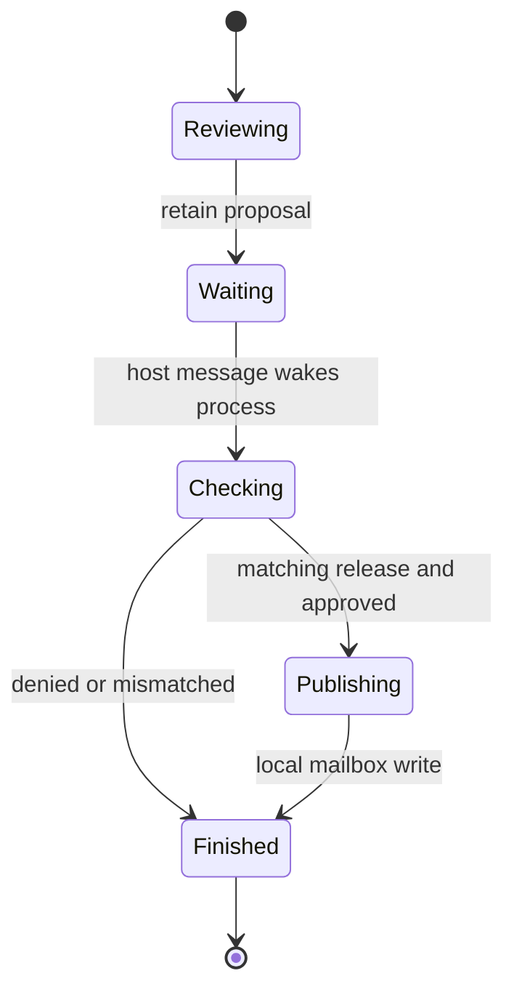

# Program diagrams

Diagrams are derived views of `algal.organism.v1` manifests. The diagram
contract is `algal.diagram.v1`; it carries the manifest digest, exact cells
and edges, declared budgets, typed ports where known, and optional recorded
cell states. It adds no execution semantics and is not an executable format.

```sh
bun cli.ts diagram examples/source/reply.algal --format svg --out reply.svg
bun cli.ts diagram examples/refine.algal.json --format mermaid
bun cli.ts diagram examples/vm/release-review.algal.json --format json
bun cli.ts diagram reply.algal.json --receipt reply.receipt.json --format svg
```

Without host/module options the command inspects the manifest without fetching
children, performing admission, or running effects. Built-in function
signatures are resolved locally. External tool/function and child signatures
remain explicitly unknown unless supplied. With `--modules`, `--tools`, or
`--transports`, normal graph admission resolves those signatures. `check` is
the admission command; a render alone is not evidence that a graph can run.

The SDK exports `createProgramDiagram(manifest, {receipt?, ports?})`,
`renderMermaid(view)`, and `renderSvg(view, {compact?, header?})`. Pass
`compileOrganism(...).ports` to expose exact admitted signatures. Renderer
inputs are typed views produced by `createProgramDiagram`; this release has
no arbitrary diagram-import parser. Treat exported JSON as a report.

## Visual grammar

| Mark | Meaning |
| --- | --- |
| Box with a kind label and stable cell ID | One exact manifest cell |
| `MODEL` | Generation, classification, or typed decision |
| `PURE` | Function, expression, or constant |
| `EFFECT`, `TOOL`, `SLOT` | An explicit executor, tool, or state boundary |
| `CALL`, `REPEAT`, `EACH`, `SPAWN` | A child-program boundary with its limits |
| Solid arrow | A named value dependency |
| Dashed arrow | A failure record delivered through a failure edge |
| Guard on an arrow | A deterministic condition controlling delivery |
| Input/output annotation | A program interface mapping |
| `RECORDED` state | A cell state from the selected receipt |

Capability ports keep their exact class when known. Tool read/write behavior
belongs to the admitted tool registry and is not inferred from its name.
Repeat cells retain their maximum rounds, carry, and stop condition, with a
reminder that exhaustion returns the last outputs. Diagrams do not invent a
back edge or clock: process ticks are dispatch/resume attempts, not synchronous
dataflow clocks. Graph rank is layout only, not a promise of concurrency.

SVG exports contain no scripts, remote assets, or `foreignObject` content.
Labels are escaped for their output format, bounded for display, and kept in
SVG titles and the JSON view. Dense diagrams are best inspected at full size;
compact views keep every cell and edge rather than silently removing effects.

## Recorded execution

An overlay checks the receipt's manifest/key binding and self-digest before
displaying its actual `committed`, `skipped`, `failed`, or `suspended` states.
Missing state means unobserved. Nested child details remain in the receipt;
the first renderer shows the top-level boundary. Round/item counts and failure
information are included when present.

A self-digest establishes internal integrity, not verified execution or
provider attestation. Run `verify` separately to recompute pure work with the
recorded effects. Rendering never repeats a live effect. The renderer does
not currently provide a replay scrubber, display all effect payloads, or claim
that a model's answer is true.

## Lifecycle and lineage views

Use a statechart when discussing the lifecycle of a durable process. This
documented domain view of the existing approval example is illustrative;
it is separate from the automatically generated exact dataflow graph:



This simplified view omits operational failures. The supervisor's actual
`ready`, `uncertain`, `suspended`, `complete`, `failed`, and `stuck` states
have the semantics in the [process contract](../spec/v1/process.md). The
source language does not execute arbitrary statecharts.

Lineage similarly explains a different object: how candidate artifacts,
evaluation cases, measurements, and host selection relate across versions.
The marketing site's selection strip is a labeled conceptual lifecycle, not
a fabricated execution record. See [foundry](../spec/v1/foundry.md) and
[civilization](civilization.md) for the recorded evaluation contracts.

## Keeping public examples honest

`bun run docs:diagrams` regenerates the README source block and five committed
SVGs from their exact fixtures. `bun run docs:check` detects drift and is part
of the aggregate check. The marketing-site build independently reads the
same source and manifests to generate its downloadable artifacts and seven
diagram assets. No hand-maintained marketing graph defines program behavior.
