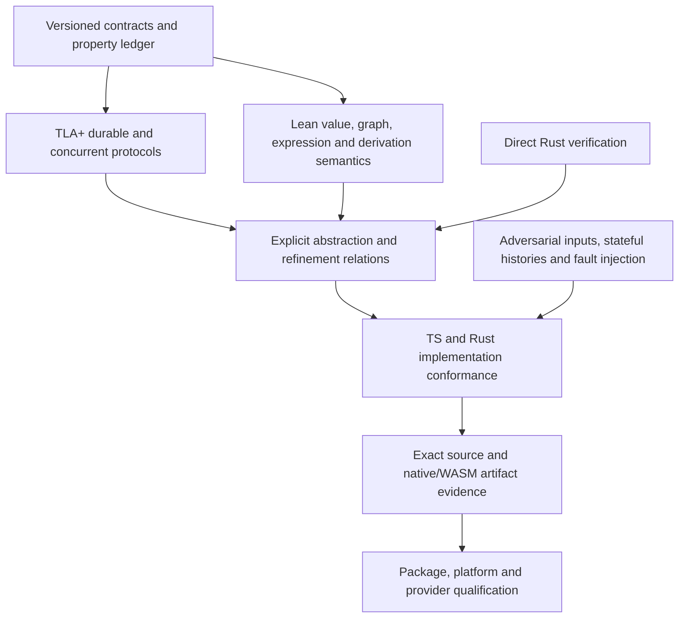

# ALGAL formal-verification and system-confidence plan

Status: execution authorized on 2026-09-23; Phases 00–03 are Complete; Phase 09 is In progress. Later phases remain Not started until their dependencies and acceptance criteria are met. Completion of infrastructure does not complete any production proof obligation.

Basis: [2026-09-23 audit](formal-verification-audit-2026-09-23.md), ALGAL tree f19f7381f80ee7745f0faa0e9e3e8eb0d43a8bfe at a86327f76f6e632fe7fceda17b738a749a341ab6. Rebase the evidence against the exact integration candidate before execution.

Execution baseline: freshly fetched main `353a5cac4ea2b2ae40e00bf9c2805606265a5378`. The [execution record](formal-verification-execution.md) tracks the implementation and delivery evidence. Application drain, inter-application messaging, retained contention, promotion experiments, evaluator-sealed research and budgeted inference were added after the audit; the ledger extends APP, EVO and HST without renumbering existing obligations. Their implementation claims remain unproved until the relevant phases below establish them.

## Outcome

Establish a maintained assurance case covering every identified ALGAL foundation boundary. Each public guarantee should state what is guaranteed, for which inputs and environment, which implementation it covers, what evidence supports it, and what remains assumed.

Use TLA+ first for concurrent and durable protocols, Lean for carefully scoped mathematical semantics, and direct implementation verification where practical. Connect models and proofs to both runtimes through explicit abstraction mappings, independent checkers, stateful testing, adversarial differential corpora, and exact artifact identity.

The first milestone is a foundation with repaired concrete counterexamples, specified crash semantics, reproducible evaluator artifacts, and small model-derived regression suites. The later milestone is a mechanically checked semantic core plus a defensible composition argument. A claim of all physical deployments or arbitrary host programs being universally correct is not a deliverable.

## Success criteria

- Every correctness-relevant public surface appears in a machine-readable property ledger; every property has an owner, precise statement, assumptions, source mapping, and evidence status.
- Reproduced audit defects have regressions and repairs in every affected runtime. Static counterexamples are reproduced and fixed or conclusively refuted with retained evidence.
- Named finite TLA+ configurations exhaust their reachable state graphs and check required safety/liveness properties. Required unsafe variants produce the intended counterexamples.
- Release-claimed Lean theorems pass kernel checking and transitive axiom audit. No sorry, admitted theorem, hidden custom axiom, or silently widened trusted base appears in a claimed proof.
- Selected production Rust routines have direct checked properties with unchanged production constants and reachable harness domains.
- Both runtimes agree with the independent semantic/reference oracles over retained conformance suites; the report distinguishes sampled conformance from a mechanized refinement theorem.
- Every supported persisted artifact produced by execution is admitted by its documented parser/consumer, or execution returns a bounded typed failure with honest effect uncertainty.
- Artifact evidence binds source, relevant dependency and toolchain inputs, expression WASM, proof/model revisions, exact commands, outcomes and supported platform.
- The repository's existing final checks, independent review and delivery policy remain intact.

## Non-goals and preserved boundaries

This plan does not replace ALGAL with a new language/runtime, rewrite the whole system in Lean, add required runtime proof-tool dependencies, or claim that finite benchmark wins prove universal agent quality. It preserves the independently runnable Bun reference runtime and native kernel.

Proofs do not authenticate model answers, guarantee arbitrary external exactly-once writes, turn capability values into OS isolation, or establish correct behavior of arbitrary host callbacks. No automatic retry may be introduced for an uncertain write to make a liveness theorem pass.

Data history, unresolved effects, operation identity, required provider approval, existing host custody and runtime access controls remain authoritative. Migrations must preserve user data and recovery paths. GC, distributed custody, whole-CAS quota, multi-tenant activation and provider signing are separate design scopes unless explicitly admitted through the corresponding extension phase.

Whole-store rollback protection is not supplied by content hashes or linked history: an older self-consistent backup can pass them. Forward strategy restoration is a different operation. Any anti-rollback claim requires an independently retained witness or anchor and its own protocol.

## Assurance contract

Use these distinct evidence levels:

| Level | Meaning | Permitted wording |
| --- | --- | --- |
| Observed | Source inspection or an executed example | “The inspected code does X”; “this case passed/failed” |
| Generated tested | Property/fuzz/differential histories executed | “Tested over these inputs, seeds, schedules and targets” |
| Finite checked | Complete exploration of a declared finite model/harness domain | “Model checked under these bounds and assumptions” |
| Proved model | Parameterized theorem checked by a proof system | “The model satisfies this theorem under these axioms” |
| Proved implementation relation | A checked connection to governed production code | “This implementation refines this semantics under this translation/TCB” |
| Qualified environment | Real artifact and operational boundary tested | “Qualified on these platforms/providers with this exact evidence” |

Do not combine these into an unexplained confidence percentage or badge.

Each property record must contain:

- Stable ID, human-readable theorem/invariant, severity and observable failure.
- Input domain, quantifiers, exclusions and explicit environment/fairness assumptions.
- Source symbols and transitive semantic dependencies in both runtimes, specification anchors, wire/semantics versions.
- Model/theorem/harness/configuration names; implementation abstraction map; whether that map is proved, tested or assumed.
- Tool versions/checksums/options, production constants, harness bounds, active safety checks, reachability witnesses, mutation controls.
- Required versus scheduled/advisory status, raw result location, exact Git tree and artifacts, outcome and unresolved obligations.
- Public claims licensed by the evidence and a named maintainer/reviewer.

The root property is compositional: admitted inputs plus host/environment contracts imply the claimed transition and evidence guarantees. Each subsystem must establish the preconditions consumed by the next. A theorem about a private pure helper is insufficient unless all public callers establish its preconditions.

## Architecture of the evidence

Arrows represent obligations, not assumed implications. For most large components, initial implementation conformance will be tested. Only the selected components with a checked code relation earn a proved-implementation label.

## Ownership and delivery constraints

One integration owner owns this plan's state, the property registry, manifests/lockfiles, exported wire schemas, module registration, toolchain pins, package scripts, shared trace schema and CI workflows. Workers own bounded disjoint scopes and focused evidence. Independent reviewers assess theorem statements, abstraction maps, counterexamples and code changes, not merely green tool output.

Formal-model workers initially own their model/reference/test files. If a counterexample requires a shared production change, the integrator assigns that change once and temporarily serializes overlapping work. Do not mark two phases parallel if they mutate the same runtime, manifest or generated artifact.

Execution follows CONTRIBUTING.md, root/nested AGENTS.md and current branch protections: task-owned branch, pull request, no force-push, independent review and required checks before integration. Preserve unrelated work. Standing authorization covers routine delivery after those gates; it does not authorize widening scope or unsafe data changes.

Native releases remain a distinct repository workflow: an existing tag must identify the workflow event commit with successful main-push CI; qualified Linux x86_64 and macOS arm64 packages are built from that exact source; publish=false stages artifacts; publication preserves current draft/prerelease rules and never overwrites stable releases or existing asset names. Proof metadata must strengthen this workflow without bypassing it. See [native release policy](native-release.md).

Use the current installed host scheduler where repository/host policy requires it, with ordinary compute for broad checks and the appropriate Mac/browser lane for scarce capabilities. Resolve its absolute installed command path and request reviewed host access with the full child argv. The audit shell returned no path for command -v oompa-host-run; do not invent an installation or bypass a denied scheduler. No new scheduler or global baseline installation is part of this plan.

## Phase map

Phase status is recorded below. The “parallel” column is conditional on the stated disjoint scopes; manifests, registration, generated outputs and workflow edits converge through the integrator.

| Phase | Deliverable | Depends on | Primary write scope | Eligible parallel work |
| --- | --- | --- | --- | --- |
| 00 | Precise claims, failure profiles, tool/CI contract | none | verify/ registry/tool pins, scripts/verify.ts, assurance docs | none |
| 01 | Repaired admission/policy/target counterexamples | 00 | affected graph/adaptation/value/evaluator boundaries and regression fixtures | none |
| 02 | Sound custody and persistence publication protocol | 01 | store/host-state/lease/application custody/mailbox publication, foundational TLA models | 03, 09 |
| 03 | Exact evaluator build and artifact conformance | 01 | expression build script, artifact metadata, target vectors | 02, 09 |
| 04 | Shared trace vocabulary, fault cuts and stateful harness | 02, 03 | trace schema/driver, test-only hooks, Hegel/TS sequence harness | 09 |
| 05 | Process, journal, mailbox and lease model evidence | 04 | verify/tla/process, verify/tla/mailbox, dedicated conformance tests | 06, 07, 08, 09 |
| 06 | Application, outbox, quota and authority models | 04 | verify/tla/application, dedicated stateful tests | 05, 07, 08, 09 |
| 07 | Scheduler and budget transition model | 04 | verify/tla/scheduler, independent small-step oracle | 05, 06, 08, 09 |
| 08 | Adversarial raw-input and differential corpus | 04 | verify/corpus, fuzz targets and dedicated differential drivers | 05, 06, 07, 09 |
| 09 | Lean value, graph and accounting foundations | 00, 01 | verify/lean/Algal/Core | 02–08 |
| 10 | Expression semantics and proof boundary | 03, 09 | verify/lean/Algal/Expr, expression proof adapters/tests | 05–08, 11, 12 |
| 11 | Independent memory checker and logical soundness | 04, 09 | verify/lean/Algal/Memory, verify/reference/memory | 05–08, 10, 12 |
| 12 | Direct production-code verification pilot | 04, 09 | verify/rust-bridge, bounded contract helpers/harnesses | 05–08, 10, 11 |
| 13 | Source lowering correspondence | 07, 09, 10 | source reference interpreter/proofs, source-specific generated cases | 11, 12, 14, 16 |
| 14 | Receipt/replay/resume assurance | 05, 07, 09, 10 | receipt checker/proofs, isolated replay conformance | 11, 12, 13, 16 |
| 15 | Memory authority, evolution and migration composition | 06, 11, 14 | adaptation/memory composition models/proofs/tests | 16 |
| 16 | Host, adapter and installed-runtime qualification | 04, 05 | adapter conformance, isolated real-process/platform fixtures | 06–15 |
| 17 | Release assurance and continuous proof maintenance | 08, 12, 13, 14, 15, 16 | release metadata/gates, generated assurance index | 18 if separately scoped |
| 18 | Hosted-system assurance extension | 00; 05/06/17 for shared claims | separate algal-cloud plan/repository | core work with separate ownership |
| 19 | Independent composition review and final qualification | 17; 18 only for hosted claims | closure report, final claim/gate integration | none |

## Phase 00: claim ledger and verification infrastructure

- **Status:** Complete
- **Depends on:** none.
- **Objective:** Make every proposed guarantee falsifiable and assign evidence ownership before adding proofs.
- **Scope:** Proposed verify/properties.json, verify/assumptions.md, verify/toolchains.json, verify/README.md, scripts/verify.ts, assurance documentation. Integrator owns any package/CI registration.
- **Out of scope:** Proof completion, global configuration changes and new runtime dependencies.
- **Approach:** Expand all audit obligation families into individual statements. Define supported profiles: pure deterministic core; local cooperating host/process crash; local filesystem machine crash; offline evidence; qualified external adapter; hosted extension. Define byte/value/receipt domains and failure states. Choose immutable tool pins/checksums after a non-publishing compatibility smoke; keep Rust 1.97.1 and Bun 1.3.14 as the inspected runtime baseline, subject to repository upgrades.
- **Acceptance criteria:**
  - Every audited public subsystem and every F01–F12 finding has an owner and phase.
  - State exactly which properties have no implementation-level proof. Opaque hash equality and host trust are assumptions, not hidden lemmas.
  - Registry validation rejects missing assumptions/bounds/source mappings, duplicate IDs, stale dependency digests and unknown evidence status.
  - An intentionally missing required harness, skipped proof, timeout, empty theorem list or unparsable tool result fails the gate.
  - A small broken model/proof fixture fails as expected. A mutation's merely crashing the tool is not evidence that the intended invariant caught it.
  - TLC configuration admission inventories state/action constraints and definition overrides, reviews any safety symmetry, prohibits symmetry for liveness checks, and verifies every named required property was enabled and completed. Nonempty initial witnesses and reachable important actions are mandatory; no-behavior/constant-only or truncated exploration cannot satisfy a full-model claim.
  - Review how changes to models, implementation dependencies, constants, toolchain and imported proof libraries invalidate evidence.
- **Validation:** Introduce and run bun scripts/verify.ts --suite claims and --suite runner-selftest. These are proposed commands; they do not exist in the audited tree. Later suite names below are part of this proposed interface. Until each suite exists and its claims are admitted, the registry reports Not started rather than green.

TLC does not establish that a proposed symmetry is valid, and its documentation excludes symmetry reduction from liveness checks. Treat reduction/configuration choices as part of the reviewed claim. [TLC symmetry documentation](https://tla.msr-inria.inria.fr/tlatoolbox/doc/model/model-values.html)

## Phase 01: close known boundary counterexamples

- **Status:** Complete
- **Depends on:** 00.
- **Objective:** Restore basic admission invariants before proving them.
- **Scope:** src/graph.ts and related foreign-key lookups; application-adaptation in both runtimes; shared storage decoding and native effect-cache retained-winner behavior; width-sensitive expression error formatting; narrowly affected tests and parity vectors. The integrator owns regeneration of src/algal_expr.wasm whenever its Rust source changes; Phase 03 subsequently establishes the pinned reproducibility gate.
- **Out of scope:** Redesigning program semantics or broad parser rewrites.
- **Approach:** Reproduce F01/F02/F03 in permanent focused tests first. Execute the native wide-index case and the native evaluation-policy counterpart. Add the native two-Store first-wins regression from F06. Repair lookup, policy, decoding and retained-winner behavior at the narrow authoritative boundary; audit analogous call sites.
- **Acceptance criteria:**
  - Missing constructor and other inherited properties reject; actually declared constructor ports and other admitted identifiers survive graph checks and replay. Own __proto__ keys remain valid JSON data where the contract admits them; the existing identifier grammar is not widened.
  - Imported evaluation evidence must satisfy every policy predicate regardless of producer. Valid hashes and successful replay cannot bypass maxCases.
  - Raw malformed bytes reject consistently under the documented domain. Explicitly resolve duplicate-key and lone-surrogate behavior without silently changing other normalization.
  - Same-key effect writers/readers/reopened stores observe the retained winner and reject malformed retained receipts.
  - Target-dependent indices/errors/fuel match the specified target-independent behavior, or an explicit versioned compatibility decision is recorded.
  - No repair masks failure by relaxing the theorem, reducing test data or converting uncertainty into success.
- **Validation:** bun test --timeout 20000 src/graph-admission.test.ts src/application-adaptation.test.ts src/store.test.ts src/values.test.ts src/expr.test.ts; cargo test --locked -p algal --test graph_admission; cargo test --locked -p algal --test cache; cargo test --locked -p algal-expr. Add targeted native adaptation/store tests and report their exact names. After cargo build --locked, run bun scripts/compilation-parity.ts, bun scripts/schema-parity.ts and the new raw-byte/target counterexample driver through the proposed boundary suite.

## Phase 02: custody and filesystem publication correctness

- **Status:** Complete
- **Depends on:** 01.
- **Objective:** Establish one valid exclusion and durability protocol for acknowledged state.
- **Scope:** Application custody cutover; native Store publication; Bun mailbox persistence; necessary host-state/lease helpers; verify/tla/custody and verify/tla/publication; dedicated regressions.
- **Out of scope:** Distributed locks, a new whole-store transaction layer, arbitrary power-loss claims on unqualified filesystems.
- **Approach:** Model the actual selection-to-acquisition gap before changing it. Prefer a stable per-application custody identity if it satisfies namespace/capacity requirements; otherwise prove an explicit handoff. Introduce deterministic barriers for the three-caller schedule. Model volatile versus durable contents and directory bindings, new ancestors, sync, rename/link/unlink, acknowledgment and crash. Repair F05 using the chosen filesystem contract.
- **Acceptance criteria:**
  - Three callers cannot successfully publish siblings from one expected head, including mixed Bun/native creation cutover.
  - An acknowledged selected head has all required durable dependencies after modeled machine crash; process crash is a separate profile.
  - Existing immutable bytes win; readers never repair corruption silently; uncertain post-publication errors remain uncertain.
  - File sync, destination/ancestor directory sync and cleanup order are covered by faultable steps. Skipping each required barrier produces the expected failed invariant or conformance case.
  - Preserve bounded namespaces, failed-creation capacity behavior and independent application progress. A global serialized host callback is not an acceptable accidental fix.
  - Existing user stores and uncertain state remain readable/recoverable under documented compatibility rules.
- **Validation:** Proposed custody and publication suites; bun test --timeout 20000 src/store.test.ts src/application.test.ts src/application-crash.test.ts src/mailbox.test.ts; cargo test --locked -p algal --test application_crash --test file_admission; bun scripts/application-parity.ts and bun scripts/mailbox-admission-parity.ts after native build. Recovery/process-custody checks use required host scheduling. Retain syscall-order/crash-image evidence plus real SIGKILL tests; label actual power-loss qualification separately.

## Phase 03: expression artifact and target identity

- **Status:** Complete
- **Depends on:** 01.
- **Objective:** Know which evaluator source and toolchain produced the WASM shipped with the Bun runtime.
- **Scope:** scripts/build-expr-wasm.sh, expression artifact metadata and target-specific comparison driver; integrator-owned CI changes.
- **Out of scope:** New expression operations or an unrelated Rust upgrade.
- **Approach:** Pin a compatible toolchain and wasm32 target; build --locked in a clean controlled environment. Bind source closure, lockfile, compiler/options and artifact bytes. Try exact-byte reproduction; if nondeterministic metadata prevents it, explain and test a reviewed normalization/provenance contract rather than silently dropping comparison.
- **Acceptance criteria:** A changed evaluator with stale WASM fails; a mismatched toolchain/lockfile fails or explicitly invalidates evidence; rebuilt and committed WASM plus native agree on values, full errors and fuel, including wide indices, rounding, Unicode and invalid inputs. A successful native test cannot substitute for WASM qualification.
- **Validation:** Pinned ALGAL_EXPR_TOOLCHAIN invocation of the repaired build script, proposed artifact suite, cargo test --locked -p algal-expr, bun test src/expr.test.ts and bun scripts/native-parity.ts. Artifact rebuild is scheduled heavyweight work.

## Phase 04: implementation traces, stateful generators and fault cuts

- **Status:** Not started
- **Depends on:** 02, 03.
- **Objective:** Turn model transitions into reproducible public-API and real-persistence histories.
- **Scope:** A test-only versioned trace schema and drivers; Hegel dev-dependencies for native stateful tests; TS command-sequence generator; deterministic barriers and filesystem fault interface.
- **Out of scope:** Wall-clock fields in canonical receipts, a second production scheduler, host data collection.
- **Approach:** Draw commands from current state, checking exact results and persisted observations after every step. Record operation identity, abstract pre/post-state, authority, effect occurrence, publication step and uncertainty. Keep timestamps, secrets and diagnostic instrumentation outside contract digests. Specify a total abstraction map including failures and stuttering.
- **Acceptance criteria:**
  - Both runtimes emit comparable traces at actual linearization/persistence points, not an imagined atomic “commit.”
  - Generated histories include stale writers, duplicate/conflicting retries, restart, cancellation, malformed state, missing dependencies and bounded exhaustion.
  - Failing histories shrink and replay from a portable fixture with exact seeds/tool versions.
  - Fixtures run in isolated directories; only owned children are killed; native tests really invoke native and Bun tests really invoke Bun.
  - Trace conformance is labeled observed/sampled. Instrumentation does not become part of the proof by trusting its own unverified assertion.
- **Validation:** Proposed traces, stateful and fault-harness suites; existing process/application/store parity. Use Valhalla's state-dependent Hegel style and preserve full-capacity deterministic examples beyond small formal bounds.

## Phase 05: durable process, journal, mailbox and owner-lease models

- **Status:** Not started
- **Depends on:** 04.
- **Objective:** Explore ordering, cancellation and recovery while preserving uncertain effects.
- **Scope:** verify/tla/process, verify/tla/mailbox, owner-lease model, dedicated model/runtime conformance fixtures.
- **Out of scope:** Claiming remote exactly-once execution or unconditionally automatic mailbox recovery.
- **Approach and initial model domains:**
  - OwnerLease: 2–3 actors, cold/initialized DB, retained inode/schema/contract, transaction owner, recognized/unknown marker, archive capacities 0/1/2. Actions include init, acquire, validate, archive, publish owner, release, crash and reopen.
  - ProcessJournal: 2–3 effect occurrences, read/write classes, two generations and 0/1/2 recovery attempts. Track process/intent/head, journal chain, ordinal cursor, poison, adapter in-flight/applied/result-known/unknown, configuration and completed prefix.
  - Mailbox: two senders, two receivers, two keys and payloads, capacity 0/1/2, revoked/active authority, pending/consumed state, pathname-lock residue. Track duplicate/conflicting send, dequeue, acknowledgment, wake readiness, revoke, death and retained-lock reconciliation. Host-side timers belong to Phase 16's HostEventService boundary, not the VM's mailbox-only scheduler.
- **Acceptance criteria:**
  - No dispatch before the required durable intent and started record.
  - Completed prefixes are immutable, consumed exactly and never blindly redispatched; repeated equal request digests remain separate occurrences where required.
  - Unknown writes remain blocked; read retry requires the admitted recovery classification/configuration and persists the recovery charge first.
  - Poison, ordinal gaps, foreign markers and configuration drift fail closed.
  - No consumed message returns to pending on an identical send retry. Revocation and dispatch admission have an explicit linearization rule.
  - Missing dequeue receipt does not imply no dequeue. Decide and document whether receive remains an uncertain non-idempotent operation or gains a retained operation/result identity; do not hide this decision in the model.
  - Conditional liveness uses explicit fairness/availability/reconciliation assumptions; no claim that every cold contender or sorted scheduled process eventually succeeds.
  - Unsafe variants for skipped intent, repeated write, cleared poison and revived message all fail the intended property.
  - Safety and liveness use admitted configurations from Phase 00. Disclose pruning/overrides and confirm actual completion of the requested temporal checks; no symmetry reduction is enabled for liveness.
- **Validation:** Proposed process-model, mailbox-model, lease-model and corresponding conformance suites; bun test --timeout 20000 src/process-journal.test.ts src/process-recovery.test.ts src/process-creation-crash.test.ts src/mailbox-admission.test.ts; cargo test --locked -p algal --test process; bun scripts/process-parity.ts. Run exhaustive small safety configurations and separate liveness configurations.

## Phase 06: application, outbox, quota and authority models

- **Status:** Not started
- **Depends on:** 04.
- **Objective:** Establish safe evolution of selected state and retained external work.
- **Scope:** verify/tla/application plus dedicated generated histories; authority and quota reference models.
- **Out of scope:** Proving arbitrary admission-host code correct, or conflating an episode's start with successful completion of its task.
- **Approach:** Compose validated custody/publication abstractions. Start with two applications, two revisions, three operations/app, two intents and small quota domains. State includes head/history, prepared operation/request, revision and memory, outbox/plan/configuration, host grant, reservations and measured bytes. Actions include prepare/admit/publish, exact retry, denial, dispatch start/apply/settle/unknown, reconciliation, memory advance, investigate, propose, activate/migrate/restore, crash/reopen.
- **Acceptance criteria:**
  - Expected-head commits and operation identities remain unique even with missing side indexes and orphan preparations.
  - Only reachable committed intents dispatch. Revision/memory are selected together; epoch/sequence follow transition kind.
  - Propose preserves selected revision, memory and epoch, creates no intents, and binds proposal evidence to the exact parent. Investigate preserves revision/memory with its required intent behavior.
  - Fresh writers bind current source; reconciliation retains the exact old plan/configuration. Unsettled dispatch blocks incompatible activation.
  - Host denial grants no authority; model output and content references cannot widen capability classes.
  - Reservations are conservative, serialized and not implicitly refunded after failure. CAS exclusion and retained-history limits remain explicit.
  - Blocked items do not consume opportunities contrary to the current algorithm; progress still requires quota, host admission and external availability.
  - Drain, inter-application messages and retained contention distinguish evidence validity, current dispatchability and source/destination authority. A migration retaining an original intent does not by itself establish that the new revision can dispatch it. A rejected contention row's later verifiability must match its documented dependence on current retained history.
  - Mutations skipping expected-head, widening capabilities, forgetting old dispatch or refunding failed quota are detected.
- **Validation:** Proposed application-model, quota-model, authority-model and stateful-app suites; bun test --timeout 20000 src/application.test.ts src/application-quota.test.ts src/application-host.test.ts src/application-restoration.test.ts; cargo test --locked -p algal --test application_crash; bun scripts/application-parity.ts.

## Phase 07: scheduler, nested execution and budget model

- **Status:** Not started
- **Depends on:** 04.
- **Objective:** Define and check the deterministic execution transition system.
- **Scope:** verify/tla/scheduler and an independent executable small-step oracle.
- **Out of scope:** Assuming every admitted graph successfully completes or that maxWork is a pre-dispatch spending limit.
- **Approach:** Model pending/done/skipped/failed/suspended cells; pending/delivered/dead edges; declared edge order, guard evaluation, arguments, nested frame path, repeated/each/spawn boundaries, ordered oracle occurrences and spent work. Begin with 2–5 cells, two input values, two nesting levels and budget boundary classes; disclose all reductions.
- **Acceptance criteria:**
  - Cells activate only with required inputs; no inactive branch effects; correct fan-in order; guards charged once; schema checks precede committing incompatible outputs.
  - Failure, on-fail routing and suspension remain distinct, including exhausted guard and callback errors.
  - Root budgets constrain nested work and calls; failed attempts remain charged. State and prove the actual overshoot envelope under host-cost and byte-bound preconditions.
  - Internal progress has a decreasing finite measure or explicit bounded failure; external waiting does not become a false deadlock.
  - Oracle-occurrence identity permits identical request digests where production does. Child output/error/context behavior matches both runtimes.
  - Broken guard ordering, double activation, reset nested budget and suspension-to-failure variants are detected.
- **Validation:** Proposed scheduler-model and scheduler-conformance suites; bun test --timeout 20000 src/run.test.ts src/kernel-safety.test.ts src/work-budget.test.ts src/graph-admission.test.ts; cargo test --locked -p algal --test kernel --test kernel_safety; bun scripts/work-budget-parity.ts and bun scripts/native-parity.ts.

## Phase 08: adversarial corpus, fuzzing and differential verification

- **Status:** Not started
- **Depends on:** 04.
- **Objective:** Exercise hostile representations and composition boundaries beyond example manifests.
- **Scope:** verify/corpus, fuzz targets and dedicated comparison drivers. Manifest/lockfile edits belong to the integrator.
- **Out of scope:** Counting fuzz time or line coverage as a proof.
- **Approach:** Use grammar-aware and raw-byte mutation with shrinking. Compare TS, native, committed/rebuilt WASM and independent oracles where available. Keep regression seeds separate from local fuzz caches.
- **Acceptance criteria:**
  - Corpus covers duplicate/unknown keys, prototypes and own keys, invalid UTF-8/lone surrogates, numeric spelling and exponent edges, -0, subnormal/extreme finite values, safe-integer boundaries, UTF-16 ordering and index-key limits.
  - Cover all cell/schema/operator forms, valid and rejected DAGs, imports/cycles/shared closure multiplicity, guards, repeats, each, dynamic spawn and exact capability narrowing.
  - Exercise boundary-1/boundary/boundary+1 for byte/count/depth/node/fuel/work/call limits, including normalized sizes and allocation growth before checks.
  - Establish sampled producer/consumer closure evidence on representative generated receipts/bundles; specifically investigate F09's aggregate byte/depth amplification and preserve honest effects if output cannot be retained. Universal closure remains Phase 14's separate obligation.
  - Mutate every security/custody/policy-relevant evidence field; also rehash whole malicious records to test semantics rather than only digest mismatch.
  - Run arbitrary adapter frames and archive paths without external effects; preserve safe extraction, special-file and symlink behavior.
  - Bound physical directory traversal, not only accepted file/configuration counts. Add orphan/nonmatching-entry and retained-lock residue fixtures for mailbox/listing paths in both runtimes; preserve recovery evidence while rejecting or stopping at the declared scan limit.
  - Report crashes, timeouts, coverage, unique minimized counterexamples and zero-case generators separately.
- **Validation:** Proposed corpus, differential, fuzz-smoke and evidence-mutation suites; existing schema/compilation/work-budget/mailbox/source-inspection parity. Scheduled deeper fuzz runs have bounded resource budgets and one owner; deterministic regressions remain required PR checks.

## Phase 09: Lean semantic foundations

- **Status:** In progress
- **Depends on:** 00, 01.
- **Objective:** Define the mathematical domain and prove foundational lemmas that later claims actually need.
- **Scope:** verify/lean/Algal/Core; Lean project registration/pins owned by integrator.
- **Out of scope:** An abstract real-number model presented as IEEE-754 equivalence; SHA-256 injectivity.
- **Approach:** Define admitted JSON/strings/numbers, normalization equivalence, finite maps, port kinds, capabilities, graph well-formedness, effect oracle and error states. Separate graph signature compatibility from runtime schema satisfaction. Use explicit finite-width representations where production behavior depends on them.
- **Acceptance criteria:**
  - Canonical encoding is deterministic and round-trips modulo the chosen normalization. Key insertion order is irrelevant; array order is not.
  - Encoding injectivity is only over the documented normalized domain. Cryptographic collision resistance remains named.
  - Admitted graph edges/interfaces refer to declared own ports; cardinality, acyclicity, child interfaces and capability-class preservation are stated precisely.
  - Checked transitions preserve typed port representations; dynamic JSON and runtime schema rejection remain allowed.
  - Accounting lemmas match the actual check boundaries and require sane admitted callback costs.
  - Every release theorem exports its transitive axioms; allow only reviewed standard logical axioms. Native evaluation or other expanded trust must be explicit and separately reviewed.
- **Validation:** Proposed lean-core and axioms suites; underlying lake build in verify/lean. Independent vector/oracle checks against all production canonicalizers. Require a nontrivial admitted witness and a rejected witness for each domain.

## Phase 10: expression semantics, fuel and safe evaluation

- **Status:** Not started
- **Depends on:** 03, 09.
- **Objective:** Prove a precisely scoped interpreter semantics and expose the remaining implementation gap.
- **Scope:** verify/lean/Algal/Expr, independent evaluator/corpus, bounded production expression proof adapters.
- **Out of scope:** Claiming a mathematical interpreter is automatically the Rust/WASM interpreter.
- **Approach:** Start with a complete small closed subset including scopes, control flow, collections and typed errors; label unsupported operators. Extend to the entire current operation set only with explicit numeric/string semantics. Resolve raw public eval versus checked run API preconditions. Verify ABI separately.
- **Acceptance criteria:**
  - Admitted evaluation is deterministic and terminates with value or typed error under fuel.
  - Fuel never underflows; charged steps and scope restoration survive short-circuit/error paths.
  - Growth checks occur before the prohibited retained allocations; distinguish semantic byte bounds from allocator/stack/RSS guarantees.
  - Collection ordering, UTF-16 length/order, ASCII case, round/mod/div-zero and nonfinite rejection match the contract.
  - Native/WASM pointer/length/allocation rules and usize conversions have explicit evidence.
  - Each theorem states whether linked to production by direct proof, translation or sampled comparison.
- **Validation:** Proposed lean-expr, expr-conformance, expr-abi and axioms suites; cargo test --locked -p algal-expr; bun test src/expr.test.ts. Run fuzzed checked entry points and raw API panic-boundary tests in isolated processes where necessary.

## Phase 11: memory derivation checker and Datalog correctness

- **Status:** Not started
- **Depends on:** 04, 09.
- **Objective:** Check logical derivations independently of re-executing the same query implementation.
- **Scope:** verify/lean/Algal/Memory, verify/reference/memory, bounded checker/test adapters; no required runtime dependency initially.
- **Out of scope:** Truth of selected base facts, negation-as-failure, unrestricted Prolog, or full alternate-support truth maintenance.
- **Approach:** Define finite positive range-restricted Datalog and an explicit derivation DAG. Build a small independent checker for fact membership/source binding, rule identity, substitution, premises and claimed tuple. Verify the optimized relation/join implementation against a simple reference, including repeated variables and canonical numeric equality.
- **Acceptance criteria:**
  - Every accepted row is derivable from the exact selected snapshot and program; fabricated premises and cycles reject.
  - A successful complete evaluation reaches the relevant least fixed point and returns every matching row under the documented limits. Exhaustion returns no complete empty/truncated answer.
  - First-canonical-witness ordering is specified and deterministic; it is not advertised as all-support provenance.
  - Duplicates, conflicting support, withdrawn/stale observations and resource failure map to the correct application status without inventing authority.
  - Context compaction preserves sources, protected intent and exact recall; byte reduction is not a token/cost theorem.
- **Validation:** Proposed lean-memory, memory-oracle, memory-mutation and context-laws suites; cargo test --locked -p algal memory::tests; cargo test --locked -p algal context::tests; bun test --timeout 20000 src/application-memory.test.ts src/application-observation.test.ts src/application-rollover.test.ts src/tool-context.test.ts; native-backed memory fixtures required by current CI.

## Phase 12: direct implementation proof and Lean linkage pilot

- **Status:** Not started
- **Depends on:** 04, 09.
- **Objective:** Demonstrate a maintainable proof over actual production code and select the bridge for deeper work.
- **Scope:** Small pure admission/count/length helpers actually called from contract boundaries; verify/rust-bridge and Kani harnesses. Avoid overlapping expression/memory implementation edits.
- **Out of scope:** A second handwritten “production” function used only by a proof.
- **Approach:** First pilot Kani on one full-width bounds/admission predicate and a bounded codec/index helper. Valhalla's Kani 0.68.0 is a candidate, not an assumed-compatible pin. In a separate bounded experiment, translate one of the same real pure helpers through pinned Charon/Aeneas into Lean. Compare Verus if the actual code fits it better. Choose one production-linkage route; do not require three proof ecosystems for every function.
- **Acceptance criteria:**
  - Production calls the proved helper; its callers satisfy documented preconditions.
  - Production capacities remain unchanged. Any small sequence/byte bound is in the claim, not disguised by reduced constants.
  - Arbitrary scalars/bytes remain symbolic; covers establish valid/invalid outcomes and satisfy assumptions.
  - Unwinding, overflow, memory-safety, undefined-function and reachability checks stay enabled; unsupported or timed-out proof is not success.
  - Translation regenerates from exact production inputs and has no unexplained external definitions/axioms. Document compiler/library/translator trust.
  - Record successful proof count, domain, runtime, maintenance experiment after a small source change, and the chosen next step. If translation fails, retain Lean as a spec/oracle and label the implementation link unproved; use direct Kani/Verus where support is established.
- **Validation:** Proposed kani, rust-bridge, bridge-drift and axioms suites, invoking the exact pinned tools. Cargo lockfiles stay unchanged by proof execution. A short feasibility budget (for example 2–3 engineer-days per bridge) prevents an open-ended toolchain rewrite; the unresolved linkage remains visible if the pilot does not meet acceptance.

## Phase 13: readable-source lowering correspondence

- **Status:** Not started
- **Depends on:** 07, 09, 10.
- **Objective:** Establish that source programs mean what their generated graphs do.
- **Scope:** Independent source interpreter, verify/lean/Algal/Source, generated source/project tests.
- **Out of scope:** Treating two kernels consuming the same compiled manifest as independent compiler verification.
- **Approach:** Specify a source semantics with the same external oracle; relate its observations to graph execution while hiding generated control cells. Prove supported transformations incrementally and record exactly which remain tested.
- **Acceptance criteria:** Name hygiene, binding scope, module identity and import closure; no inactive-arm evaluation/effects; exhaustive matches and short circuiting; generated controls excluded from model context; exact call/each argument and ordered-result behavior; maximum selected-path call/depth analysis; dynamic type failures preserved; source maps remain outside executable identity.
- **Validation:** Proposed source-reference, lean-source and source-differential suites; bun test --timeout 20000 src/source.test.ts src/source-project.test.ts src/source-trace.test.ts src/source-errors.test.ts src/source-diagnostics.test.ts; bun scripts/source-inspection-parity.ts and bun scripts/native-parity.ts. Counterexamples include empty batches, parameterless calls, nested guards and repeated shared imports.

## Phase 14: receipt, replay, resume and evidence assurance

- **Status:** Not started
- **Depends on:** 05, 07, 09, 10.
- **Objective:** Establish the exact meaning of a verifying receipt and a safe continuation.
- **Scope:** Independent trace checker/proofs, verify/lean/Algal/Replay, replay/evidence generated tests.
- **Out of scope:** Authenticating an untrusted effect oracle or claiming portable process evidence proves the full journal/custody history.
- **Approach:** State verifier soundness relative to deterministic semantics, admitted registry and recorded external oracle. Separate soundness from completeness for produced receipts. Track repeated requests by occurrence and preserve prefix effects. Distinguish recorded runtime/manifest/executor metadata consistency from supported semantics-version admission and independently authenticated artifact provenance; replaying a claimed runtime stamp cannot establish the original executable identity.
- **Acceptance criteria:**
  - Every admitted produced status (complete/failed/stuck/suspended) has the documented replay outcome.
  - Verification performs no live provider/tool dispatch or underlying mutable-store write under the admitted callback contract.
  - Resume validates its prefix before live tail admission; settled prefix effects and slot writes never execute again.
  - All admitted fields are compared or deliberately outside the claim; rehashed inconsistent evidence rejects.
  - A rehashed fabricated runtime stamp has an explicit tested outcome and cannot be presented as authenticated provenance. Resolve unsupported semantics-version admission separately from metadata comparison.
  - Closed portable dependencies and exact missing sets reject undeclared ambient reads even when caught errors could otherwise replay.
  - Artifact byte/depth/node closure is established or typed bounded failure preserves custody.
  - Replacing an oracle and recomputing an internally consistent history is correctly described as different execution evidence, not automatically detectable forgery.
- **Validation:** Proposed lean-replay, replay-isolation, receipt-closure and evidence-mutation suites; bun test --timeout 20000 src/verify.test.ts src/process-evidence.test.ts src/process-evidence-cli.test.ts src/bundle.test.ts; cargo test --locked -p algal --test process_evidence; bun scripts/cli-parity.ts and bun scripts/process-evidence-demo.ts --native ./target/debug/algal.

## Phase 15: application meaning, memory authority and evaluated evolution

- **Status:** Not started
- **Depends on:** 06, 11, 14.
- **Objective:** Connect logical evidence to the selected application state and host admission.
- **Scope:** Memory/evolution composition proofs/models, evaluation/selection/migration/restoration conformance and policy fixtures.
- **Out of scope:** Inferring universal candidate quality from finite cases, or semantic preservation from replay alone.
- **Approach:** Prove transition and admission lemmas over the existing records. Define scope/frontier/decoder/attestation identities, supported/opposed/conflicted/unknown/stale/exhausted/failed/cancelled states, captured views and current versus retained work. Model policy/host decisions separately.
- **Acceptance criteria:**
  - A displayed/actionable derivation binds exact captured state, selected facts/program, admission host, engine and frontier; stale evidence cannot start fresh work.
  - Evaluation verification entails every count/work/call/quality/compatibility predicate. Holdout data cannot influence generation/selection through the admitted pure case environment.
  - Selection rechecks every environment row and exact parent; immutable stored policy grants nothing without host opt-in.
  - Promotion experiments bind every joined evaluation/selection/memory/environment row. Evaluator-sealed research requires the configured trusted verifier and exact corpus/experiment identity; a digest of a research artifact alone grants no acceptance authority.
  - Migration binds exact non-withdrawn source projection, pure producing program, receipt and emitted claims. Any claim of meaning preservation has an explicit old/new schema relation and proof.
  - Restoration creates a new forward revision and preserves current memory, non-widening authority/budgets and old work custody.
  - Optional proof-carrying strategies bind the exact program, semantics version, precondition and theorem; ordinary finite-evaluation acceptance retains its narrower meaning.
- **Validation:** Proposed evolution-model, memory-authority, lean-admission and policy-mutation suites; bun test --timeout 20000 src/application-adaptation.test.ts src/application-comparison.test.ts src/application-selection.test.ts src/application-restoration.test.ts src/application-proposal.test.ts src/application-view-evidence.test.ts src/application-integration.test.ts; bun scripts/application-parity.ts; native adaptation/selection/memory focused tests.

## Phase 16: host and runtime qualification

- **Status:** Not started
- **Depends on:** 04, 05.
- **Objective:** Validate assumptions that mathematical models leave at the host boundary.
- **Scope:** Store/Executor/Transport/Tool/MemoryAdmissionHost conformance; gateway/Jev/xcb/ACP fixtures; HostEventService dueAtMs/poll delivery; credential, retrieval, coding-job, repair and GitHub adapter checks.
- **Out of scope:** Unrequested live spending, copying credentials, inventing sandbox guarantees or automatically retrying ambiguous commands.
- **Approach:** Publish a conformance contract for callback purity, signatures, costs, bounds, configuration identity, cancellation and uncertain completion. Test bounded streams before allocation, drains, deadlines, child exit, cancellation and stale config. Use deterministic local fixtures first; qualify a live provider only for an explicit adapter claim with allowed account, target and budget.
- **Acceptance criteria:**
  - Invalid host costs/signatures or returned values cannot silently corrupt the stated accounting theorem; arbitrary callbacks are explicitly outside the proved profile.
  - Provider output never grants authority; prompts/context have bounded declared provenance; timeouts do not imply remote rollback.
  - Credential and subprocess data remain private; actual process stop is distinguished from sending a signal.
  - Coding operation recovery binds exact repo/ref/workspace/adapter identity; uncertain completion keeps custody.
  - Semantic index reads are bounded while streaming; corruption/rebuild, float ties, model identity and source references are exercised; relevance never becomes logical truth.
  - Host-event dueAtMs eligibility, clock movement, horizon/pass/duration limits, cancellation and sending/delivered markers preserve idempotent mailbox delivery and retained uncertainty. Wall-clock eligibility remains host state and is not added to deterministic VM receipts. Distinguish these timers from hosted Durable Object alarms.
  - Verify executable identity assumptions, including the native-memory hash-to-exec path and injected expression evaluator, under the supported host threat model.
  - Portable Chat Completions protocol variants preserve configuration/request identity and bounded stream/cancellation/uncertainty semantics. Durable inference reservations stay conservative across restart and concurrent lease cleanup failure; any permanent-stop contract requires a durable barrier before a second caller can continue.
  - Real platform tests record exact binary/runtime/tool identity and capability denials; mocked/fake fixtures and live qualification have different labels.
- **Validation:** bun test --timeout 20000 src/gateway.test.ts src/jev.test.ts src/credentials.test.ts src/io.test.ts src/xcb.test.ts src/coding-operations.test.ts src/coding-jobs-operations.test.ts src/github.test.ts src/shepherd.test.ts src/repair.test.ts src/semantic.test.ts src/host-events.test.ts; cargo test --locked -p algal --test acp --test http --test apple_adapter; python -m unittest discover -s examples/coding-harness -p 'test_*.py'; proposed host-conformance suite. Live Apple inference requires doctor --apple and a real bounded inference result, not compilation alone.

## Phase 17: release assurance and proof maintenance

- **Status:** Not started
- **Depends on:** 08, 12, 13, 14, 15, 16.
- **Objective:** Keep evidence current as the implementation and shipped artifacts change.
- **Scope:** Assurance manifest/schema, CI dependencies, generated coverage report, native/WASM/package evidence and documentation.
- **Out of scope:** Adding a redundant merge queue, claiming checksum authenticity, or weakening existing release approvals.
- **Approach:** Bind property results to exact semantic source closure and relevant environment. Require small formal jobs on semantic changes; run larger complete models/fuzzing on a documented schedule with claim freshness rules. Use successful existing integration CI as policy permits; do not replace required local/native/live gates with cached evidence.
- **Acceptance criteria:**
  - Production/spec/harness/constants/toolchain changes trigger relevant proof review and checks, including indirect dependencies. A deliberate unmapped semantic change fails the policy self-test.
  - Reports distinguish proved/model-checked/tested/unqualified claims and never promote timeout/skipped/empty results.
  - Tool downloads are pinned and checksum-verified; untrusted PR workflows cannot publish or access provider secrets.
  - Proof metadata binds exact source/proof/model/lockfile/compiler/artifact identities; packaged source identity cannot stand in for actual binary qualification.
  - Unsigned packages remain described as unsigned; receipt digests are not publisher signatures.
  - Restore/upgrade fixtures preserve previous data and uncertainty; supported mixed-version claims have explicit wire/model compatibility evidence.
  - There is a process for proof refactoring, toolchain upgrades, changed assumptions and retiring claims; a tool update reruns affected evidence.
- **Validation:** Proposed assurance, change-impact, release-evidence and gate-selftest suites; python3 scripts/test-release-workflow.py; current package/installer checks on the actual release binary; complete current integration checks. Measure proof runtime and flakiness; set budgets from measurements rather than reducing coverage to meet an arbitrary clock.

## Phase 18: hosted assurance extension

- **Status:** Not started
- **Depends on:** 00 for scoping; 05/06/17 for reuse of shared claims.
- **Objective:** Include hosted behavior only through its own implementation and operational evidence.
- **Scope:** A separate plan in algal-cloud following its PROTOCOL.md and repository instructions. Current audit only surveyed this repository.
- **Out of scope:** Automatically treating the current hosted spike as production-qualified or deploying it as part of this planning task.
- **Approach:** Refresh the hosted snapshot and its pinned ALGAL dependency (the audited package uses a different ALGAL commit). Map tenant/auth/revocation, Durable Object transactions/alarms, execution fencing, outbox claim/lease/settle, broker reservations, pricing/metering, paged backup/fencing/restore and permanent archive read-only behavior. Decide whether these enter the requested product assurance envelope.
- **Acceptance criteria:**
  - Lost bridge leases permit at-least-once claims without claiming exactly-once arbitrary external execution. Settlement identity and duplicate/conflicting results are explicit.
  - Revocation blocks new authority while previously admitted settlements obey the documented rule.
  - Broker uncertainty preserves reservations; meter rollups bind exact receipts and tariff versions with overflow/rounding properties.
  - Backup is a coherent bounded snapshot; restore cannot revive unsettled work or double bill; partial restore stays unactivated.
  - Alarm-only progress has explicit availability/capacity assumptions.
  - Cloud models are linked to actual Worker/DO implementations and real deployed identity, persistence and recovery checks.
- **Validation:** Existing algal-cloud bun run check, including workerd tests, plus new hosted-model/conformance suites. Separate operator-authorized live qualification and full-size recovery from local proof/admission checks. If hosted behavior is outside the selected product scope, record Excluded from core claims rather than pretending this phase is complete.

## Phase 19: independent composition review and final qualification

- **Status:** Not started
- **Depends on:** 17; also 18 for any hosted claim.
- **Objective:** Verify the claim chain, integrated code, artifacts and delivery without relying on each subsystem's local success alone.
- **Scope:** Final assurance report, public claim wording and integration evidence.
- **Out of scope:** Declaring all phases done because tools compiled or the time budget elapsed.
- **Approach:** An independent reviewer traces each top-level guarantee through assumptions, model/theorem, implementation relation, runtime evidence and artifact. Challenge the spec with adversarial examples and review that abstractions do not remove the bug classes they claim to cover.
- **Acceptance criteria:**
  - Every high-priority finding is repaired or refuted, with exact evidence; residual risks and incomplete implementation proofs remain visible.
  - Environment assumptions used by one component are established by its caller or explicitly accepted as part of the supported profile.
  - Full current-tree repository validation and proof aggregate pass; supported native/WASM/install identities match the reviewed source.
  - Shipped wording identifies the proved core and tested shell accurately.
  - Final record includes branch, PR/review/checks, merge, applicable tag/release/artifact/deployment and production verification evidence. None of those records is fabricated when the action is out of scope.
- **Validation:** The unchanged repository final gates below, proposed bun scripts/verify.ts --suite all-required, independent review, and exact-artifact qualification under the repository delivery policy.

## Existing integration validation to preserve

These commands exist in the audited repository. Run applicable focused checks while working, then the required aggregate/final gate once after convergence. Reuse focused evidence only for identical relevant inputs; never use a receipt to skip a required final gate.

    bun run check
    cargo fmt --all -- --check
    cargo clippy --workspace --all-targets --locked -- -D warnings
    cargo test --workspace --locked
    cargo build --locked
    bun scripts/native-parity.ts
    bun scripts/application-parity.ts
    bun scripts/process-parity.ts
    bun scripts/store-parity.ts
    bun scripts/cli-parity.ts
    bun scripts/source-inspection-parity.ts
    bun scripts/schema-parity.ts
    bun scripts/compilation-parity.ts
    bun scripts/work-budget-parity.ts
    bun scripts/mailbox-admission-parity.ts
    bun scripts/vm-demo.ts --native ./target/debug/algal
    bun scripts/recovery-demo.ts --native ./target/debug/algal
    bun scripts/repair-demo.ts --native ./target/debug/algal
    bun scripts/coding-recovery-demo.ts --native ./target/debug/algal
    bun scripts/process-evidence-demo.ts --native ./target/debug/algal
    python -m unittest discover -s examples/coding-harness -p 'test_*.py'

Also preserve CI's native-backed harness-memory and adaptive-inventory tests, release-mode build and actual binary/package smoke, and Apple fixture qualification:

    ALGAL_MEMORY_NATIVE="$PWD/target/debug/algal" bun test examples/coding-harness/memory-records.test.ts examples/coding-harness/memory.test.ts
    ALGAL_MEMORY_NATIVE="$PWD/target/debug/algal" bun test examples/adaptive-inventory/run.test.ts
    cargo build --release --locked -p algal --bin algal

Use the exact current CI arguments for scripts/test_apple_brief_demo.py and scripts/test-native-release.py, with the actual built binary, source commit and rustc identity. A temporary output directory is required for the Apple fixture; it is not live inference qualification.

Formal runner implementation must retain raw commands and outcomes. Typical internal invocations are pinned TLC via java -cp ... tlc2.TLC with an explicit model/config, lake build in verify/lean plus transitive axiom extraction, and pinned cargo kani harnesses with checked safety/unwind settings. The proposed suite wrapper normalizes results and custody; it must never convert partial/unsupported outcomes into passed evidence.

## Prioritization, sizing and decision points

Milestone A is phases 00–04: concrete bugs, durability/custody, reproducible artifacts and a reusable conformance harness. Begin with the proven admission gaps and three-caller custody schedule. This provides immediate confidence and reveals the actual formalization boundary.

Milestone B combines 05–12: small exhaustive lifecycle models, adversarial generators and the first Lean/direct-code proofs. Run independent model and proof lanes in parallel. Expand bounds based on measured state growth and proof cost; never label a smaller model an unbounded theorem.

Milestone C is 13–17 and 19: compiler/replay/memory/evolution composition and release maintenance. Phase 18 is required before extending claims to hosted behavior.

Rough planning bands, to be replaced after the first pilots: a focused counterexample repair is usually days; a model plus useful runtime correspondence is commonly one to two engineer-weeks; production-linked interpreter/compiler proofs can require multiple months. These are effort-risk estimates, not delivery commitments. Tool count and lines of proof are not progress metrics.

| Decision | Recommended default | Resolver / deadline |
| --- | --- | --- |
| Numeric/string/foreign-JSON domain | Specify current intended cross-runtime semantics; reject ambiguity consistently | Core maintainer during 00/01 |
| Machine-crash durability profile | Local supported filesystems with explicit barriers; distinguish process-only profile | Storage maintainer during 02 |
| Creation custody | Stable per-name mutex if compatible with capacity semantics | Runtime maintainer during 02 |
| Mailbox receive uncertainty | Preserve conservative behavior until an explicit receive identity/reconciliation contract is justified | Runtime maintainer during 05 |
| Lean-to-production bridge | Small Aeneas feasibility pilot; keep direct Kani and consider Verus for unsupported Rust kernels | Verification owner during 12 |
| Permanent proof gate cost | Required small suites plus documented larger scheduled runs; gate claims on required evidence | Integration owner during 00, measured in 17 |
| Hosted product scope | Separate assurance envelope and exact dependency version | Product/runtime owner during 18 scoping |
| Migration meaning | Require an explicit schema relation for any semantic-preservation claim | Domain owner before each migration claim |

A decision to weaken a public guarantee, change wire semantics or activate a materially different operational behavior needs the corresponding product review. Routine implementation choices and delivery within accepted scope do not require repeated conversational confirmation.

## Maintenance and confidence reporting

Publish a generated matrix with one row per claim: exact scope, current source, evidence level, assumptions, last required result, independent review, open counterexamples and next obligation. Avoid a universal green “proved” label.

Track counterexamples found/fixed, mutation detection, mapped versus unmapped public claims, actual implementation-proof coverage, inconclusive proofs, artifact drift, model state counts, corpus growth and proof maintenance cost. Do not reward reducing a theorem's domain or excluding difficult actions merely to improve a metric.

Retain raw failing evidence and minimized fixtures. A passing model with zero admitted initial witnesses, permanently disabled important actions, empty theorem export or impossible harness assumptions is a verification defect.

## Implementation log

<!-- Empty. Record date, phase, behavior, exact validation, independent review,
     commits/PRs, deviations and residual risks only when implementation begins. -->
