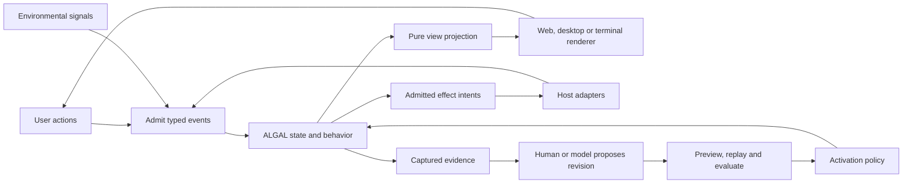

# ALGAL as a substrate for malleable applications

Research and proposed architecture, 2026-09-23. This records the design before implementation. The [malleable marketing component](malleable-site.md) implements the first bounded slice; the broader stages below remain proposals. The previous research strategy remains inactive.

**Recommendation.** Make an ALGAL application a durable, inspectable combination of behavior, state, knowledge, presentation, and change policy. Give humans and models the same structured ways to propose changes. Keep a small trusted host responsible for executing effects, rendering, and admitting revisions. Use Elm's interaction model, investigate Dioxus as a renderer, and preserve independent terminal and platform-specific renderers.

The user selected an evolving component embedded in an existing marketing site as the first end-to-end demonstration. Begin in a preview of that site. A small local/native and terminal conformance example should accompany the early UI work so portability is tested before the design becomes web-specific.

**The previous strategy should remain inactive.** Its proposal exceeded the admission bound, and the measured treatment scored 5/8 against the incumbent's 6/8. Eight synthetic cases establish neither a general Datalog benefit nor a reliable general deficit. They do show why proposal validity, execution evidence, and quality evidence must remain separate. Retain that experiment unchanged; design new experiments for new hypotheses. [Recorded result](https://github.com/hraness/algal/blob/353a5cac4ea2b2ae40e00bf9c2805606265a5378/docs/application-research-results-2026-09-23.json)

## 1. What the vision should mean

A user can inspect a visible component, understand where its content and behavior came from, change it in context, preview the result, preserve their data, and return to an earlier revision. An agent can perform those same operations within an owner-defined scope and budget. The application keeps working when inference is unavailable.

Malleability includes changing content, layout, interactions, workflows, schemas, queries, and domain behavior. It includes personal forks and direct editing, not only automatic optimization of a metric. The intended progression is use → inspect → edit → compose → program; prompting is one authoring interface among several. This follows the user-agency direction of Ink & Switch's [malleable software research](https://www.inkandswitch.com/malleable-software/) and its work on [in-place end-user programming](https://www.inkandswitch.com/end-user-programming/).

“Backed by the VM” should mean that the application's meaningful behavior and presentation are represented by versioned ALGAL artifacts. It does not require the VM to implement a browser, text shaping, GPU rendering, or every platform widget. The trusted renderer and effect adapters remain ordinary compiled software. Their contracts and versions are explicit parts of application compatibility.

There are three different kinds of change:

| Change | Example | Appropriate mechanism |
| --- | --- | --- |
| Interaction | Type a draft, submit a form, expand a section | Deterministic update/view loop; no inference required |
| Adaptation | Render a compact layout or show current inventory | Existing rules responding to admitted inputs |
| Evolution | Replace the layout rule or introduce a new workflow | New application revision, compatibility checks, evaluation and activation |

This distinction prevents every responsive behavior from becoming a model call or a program upgrade.

## 2. Existing foundations and actual gaps

The ALGAL source snapshot is `353a5cac4ea2b2ae40e00bf9c2805606265a5378` (PR #64). The cloud research snapshot is `064fd9416281057a193032883c998e5520d39d47`.

| Area | Present foundation | Work still required |
| --- | --- | --- |
| Runtime | Typed bounded programs, explicit effects, receipts, replay, durable processes and mailboxes | Low-latency interactive application hosting and a renderer-facing contract |
| Application lifecycle | Revision/memory heads, expected-head activation, evaluation joins, episode pinning, migration/drain machinery | UI-specific compatibility, session continuity, presentation state and rollout semantics |
| Knowledge | Scoped observations, queries and derivation evidence | Product signal admission, freshness/attribution and usable explanations connected to the screen |
| Presentation | Diagnostic views and passive HTML workbenches | Interactive semantic view trees, event routing, renderer adapters and in-place editing |
| Evolution | Bounded model proposals, sealed evaluation, lineage and conservative activation | General UI/behavior proposal scopes and online experiment policy |
| Inference | XCB, Gateway, portable endpoints and native Apple integration | Product-level local mode, scheduling and understandable controls |
| Browser | Portable expression WASM | A supported full browser application runtime and browser storage/effect adapters |
| Cloud | Durable hosted execution and operational APIs | Alignment with the newer application lifecycle, UI delivery and an operator workbench |

The current application design is already close to the proposed semantic ownership boundary. Its revisions name procedures, queries, schemas and diagnostic views, while state captures revision and memory references together. Reuse that model instead of introducing an unrelated UI database. [Application architecture](https://github.com/hraness/algal/blob/353a5cac4ea2b2ae40e00bf9c2805606265a5378/docs/programmable-applications.md), [application contract](https://github.com/hraness/algal/blob/353a5cac4ea2b2ae40e00bf9c2805606265a5378/spec/v1/application.md)

The existing research gate is deliberately narrow: it changes one pure strategy while preserving the surrounding revision metadata. It does not authorize arbitrary UI, schema or capability changes. New evolution scopes need explicit contracts and appropriate evidence. [Research restrictions](https://github.com/hraness/algal/blob/353a5cac4ea2b2ae40e00bf9c2805606265a5378/src/application-research.ts#L116)

Existing diagnostic views have five fixed widget kinds; they are not a general UI tree. Existing migration transforms selected observation claims, and restoration makes a forward child revision while retaining current memory and authority. General session/object migration and historical data rewind are separate work. [View contract](https://github.com/hraness/algal/blob/353a5cac4ea2b2ae40e00bf9c2805606265a5378/src/application-view.ts#L15), [migration](https://github.com/hraness/algal/blob/353a5cac4ea2b2ae40e00bf9c2805606265a5378/src/application-migration.ts#L71), [restoration](https://github.com/hraness/algal/blob/353a5cac4ea2b2ae40e00bf9c2805606265a5378/src/application-restoration.ts#L44)

Browser portability must be earned. The full Rust host depends on SQLite, filesystem/process facilities and networking. The TypeScript package targets Bun, with filesystem and Bun SQLite custody. Today the expression evaluator, rather than the whole host, has a WASM build. Initially a website can consume revision-bound projections and send typed commands to a host. A fully local browser app requires extracting a portable application core and supplying browser adapters. [Native dependencies](https://github.com/hraness/algal/blob/353a5cac4ea2b2ae40e00bf9c2805606265a5378/crates/algal/Cargo.toml), [expression WASM build](https://github.com/hraness/algal/blob/353a5cac4ea2b2ae40e00bf9c2805606265a5378/scripts/build-expr-wasm.sh), [host state](https://github.com/hraness/algal/blob/353a5cac4ea2b2ae40e00bf9c2805606265a5378/src/host-state.ts)

## 3. Application and presentation architecture



The interaction contract is conceptually:

```text
update(revision, state, admitted_event) -> next_state + effect_intents
view(revision, captured_state, renderer_profile) -> semantic_view
```

These are proposed architectural functions, not existing API names. They should lower into ALGAL's typed program/effect machinery. Time, randomness, network results and model responses enter as explicit recorded inputs; the pure projection never reads an ambient clock or calls a model.

Elm's model/update/view structure and described commands/subscriptions supply a strong reference. Crux independently demonstrates a shared Rust behavior core with message-based native shells and separately executed effects. Borrow those boundaries; neither framework must become a required ALGAL dependency. [Elm architecture](https://guide.elm-lang.org/architecture/), [Elm effects](https://guide.elm-lang.org/effects/), [Crux design](https://redbadger.github.io/crux/)

Keep four kinds of state distinct:

- **Application state:** durable domain data and meaningful workflow state.
- **Knowledge:** admitted sources, claims, queries and uncertainty, referenced by the application snapshot.
- **Session state:** drafts, navigation and selections whose lifetime is explicitly defined.
- **Renderer state:** focus, IME composition, scroll and animation machinery. Some of this needs continuity across revisions, but not every pointer movement belongs in the durable journal.

Do not rebuild a whole durable process for each keystroke. Define the durability boundary per action, retain fast transient interaction in the renderer, and checkpoint meaningful session data according to a documented policy. An unavailable model must not slow typing, rendering or ordinary deterministic actions.

A view description should contain stable semantic node IDs, typed properties, accessible labels and roles, typed action bindings, bounded children, design tokens, content/asset references and a required renderer profile. Start with text, image, link, button, input, checkbox, choice, list, stack and status. Domain kits can add richer widgets through registered, versioned host implementations.

People must also be able to define reusable components as ALGAL data/programs: typed inputs, local state schema, child composition and typed outputs/actions. Changing a composition or its behavior should not require adding a native widget. Define lifecycle, state ownership and effect cancellation/reconciliation explicitly; a child does not acquire extra capabilities simply by being inserted into a view. The primitive vocabulary needs a versioned extension path as expressiveness grows.

Avoid both arbitrary HTML/JavaScript as the universal contract and a lowest-common-denominator screen. Share behavior and meaning; allow explicit web, terminal and platform-specific presentation profiles. Unsupported requirements produce a clear compatibility result or defined fallback, never a silent approximation of a critical control.

Events bind to the displayed revision, application/session identity, semantic node/action identity, expected state or event epoch, deduplication identity and bounded payload. An old click must not invoke a newly assigned operation after activation. Preserve component keys and drafts during compatible updates; define explicit migration or session pinning for incompatible changes. New revisions govern new work, while already admitted effects keep their original identity and reconciliation rules.

Stable keys alone are insufficient for an actively edited control. Compatibility must include semantic identity, widget-state version and relevant parent/lifecycle constraints. The initial policy should defer an incompatible surface replacement while a user is composing text or has an unsaved draft, preserving a session snapshot until an explicit safe transition. A pinned old session must not silently write through a newer incompatible authority/state head. Show when a transition needs resolution; define focus restoration when a control disappears. Stage A needs fixtures for changing widget kind, moving a control across parents, removing it during IME composition, preserving its draft, and preventing duplicate submission. Compatible changes may proceed without disrupting the interaction.

Content, view definitions and behavior should be separately addressable inside one coherent revision. A copy edit then reuses unchanged program objects. Rendering and the inspector must reference the same captured state, so “why this?” explains the content the user actually saw. Bind deterministic facts directly to presentation; do not ask a model to restate a verified value merely to render it. Morphic's direct manipulation and inspectable live structure are a useful historical reference for this experience. [Original Morphic paper](https://bibliography.selflanguage.org/directness.html)

## 4. Dioxus decision and renderer experiment

Dioxus is a leading candidate, not a settled architectural dependency. Reviewed documentation is the 0.7 series, including published 0.7.10 core APIs; no framework prototype was executed in this research.

| Route | Finding | Proposed use |
| --- | --- | --- |
| Dioxus Web | WASM driving browser DOM; selectable mount root | Test as an embedded surface against a small semantic HTML baseline |
| Dioxus desktop/mobile | Native Rust logic with a system WebView | Early local application candidate; do not call these platform-native widgets |
| Dioxus Native / Blitz | Separate HTML/CSS/WGPU path; Blitz is beta | Later qualification, especially text input and accessibility |
| Dioxus TUI | Deprecated | Use a separate Ratatui adapter |
| Dioxus LiveView | Deprioritized server/WebSocket approach | Do not make it the foundation of offline operation |

[Dioxus platform structure](https://dioxuslabs.com/learn/0.7/beyond/project_structure/), [Blitz status](https://github.com/DioxusLabs/blitz#status), [Ratatui's Elm architecture](https://ratatui.rs/concepts/application-patterns/the-elm-architecture/)

A compiled recursive renderer can interpret a changing ALGAL view tree using keyed components. Layout, content, tree structure and action bindings can change without compiling new Rust. Dioxus's RSX and VNode APIs support dynamic content, while optimized templates use static structures. Begin with a fixed interpreter over versioned widgets, and measure allocation/reconciliation behavior through repeated revisions. [RSX](https://dioxuslabs.com/learn/0.7/tutorial/rsx/), [template API](https://docs.rs/dioxus-core/0.7.10/dioxus_core/struct.Template.html)

Development hot reload and experimental Rust hotpatching are useful tooling, but they are not ALGAL's production evolution protocol. Arbitrary new native code remains a separately built and admitted host extension. [Dioxus hot reload](https://dioxuslabs.com/learn/0.7/essentials/ui/hotreload/)

The renderer spike should test one small interactive artifact in Dioxus Web, a desktop WebView and a minimal Ratatui renderer. Cover stable focus and draft preservation, IME input, keyboard navigation, accessible names, stale events, restart, repeated revision swaps, and multiple web mounts/unmounts. Measure additional download size, startup, interaction latency, retained memory and host-site style/router interference. Set performance budgets against the chosen host site before declaring success.

For marketing embeds, useful HTML must exist before the interactive renderer loads. Use a static/SSR projection from an exact revision and state snapshot, then attach interaction without changing that initial tree. Dioxus supports SSR/hydration, but its app-oriented approach does not itself prove lightweight island integration. Hydration, teardown and cache invalidation need explicit tests. A custom element can provide an integration wrapper; it is not a security sandbox. [Web mounting API](https://docs.rs/dioxus-web/latest/dioxus_web/struct.Config.html), [Dioxus SSR](https://dioxuslabs.com/learn/0.7/essentials/fullstack/ssr/), [custom elements](https://html.spec.whatwg.org/multipage/custom-elements.html)

If Dioxus fails the embed or platform requirements, keep the contract and change the adapter. Slint's runtime interpreter is a relevant comparison if dynamic native presentation becomes the dominant need; this is an alternative to investigate, not a second framework to adopt now. [Slint interpreter](https://docs.rs/slint-interpreter/latest/slint_interpreter/)

## 5. Signals and evolution policy

Signal inputs need different treatment according to purpose:

| Signal | Example | Role |
| --- | --- | --- |
| Domain fact | Inventory, availability, a release announcement | Deterministic application input |
| User intent | A direct edit, chosen preference, explicit feedback | Owner/user-directed behavior and change |
| Environment | Screen constraints, locale, offline status, reduced motion | Rendering and operation within existing rules |
| Outcome evidence | Qualified conversion, task completion, error or latency | Evaluation of a proposed revision |

Use an adapter that maps external events into a bounded ALGAL envelope: source and event identity, schema/version, scope, observed time where supplied, admitted sequence, provenance, payload, and relevant revision/experiment exposure identity. Add authentication, deduplication, late-data handling, retention and per-source bounds at admission. External text is evidence or content, never implicit authority to modify the application.

CloudEvents is a useful external envelope to interoperate with webhooks and event systems; it does not supply ALGAL's trust, ordering or activation rules. OpenTelemetry is useful for operational traces, metrics and logs; sampled telemetry must not replace the complete evidence required by an activation decision. [CloudEvents](https://cloudevents.io/), [OpenTelemetry signals](https://opentelemetry.io/docs/concepts/signals/)

Evolution proceeds through captured observations → scoped proposal → preview → compatibility and behavior checks → evaluation → eligible revision → policy-authorized activation → observation of outcomes. Record failures and inconclusive results as first-class outcomes. The proposer cannot change its own evaluator, capability limits, budget or rollout policy through an ordinary application edit.

Use different evaluation policies for different purposes. A person rearranging their private application need not prove population-level conversion uplift. It still must preserve data, satisfy contracts and stay within their authority. An autonomous public-site optimizer needs stronger evidence and an owner-declared objective. A schema change requires migration evidence even if its visual result looks better.

For marketing experiments, freeze assignment and measurement definitions, preserve a stable incumbent, track actual exposure, and distinguish qualified conversions from clicks. Validate event loss and assignment ratios before interpreting improvement; retain holdouts and account for repeated candidate selection. Decide the randomization unit, statistical approach, minimum meaningful effect, sample/horizon and guardrails before a trial. Small traffic should produce “insufficient evidence,” not a manufactured winner. Require an A/A instrumentation test and rejection of seeded harmful variants before automated promotion. [Microsoft's experiment validity research](https://www.microsoft.com/en-us/research/publication/diagnosing-sample-ratio-mismatch-in-online-controlled-experiments-a-taxonomy-and-rules-of-thumb-for-practitioners/)

Fixed-horizon analysis is a reasonable starting option. If continuous monitoring is needed, use a calibrated sequential method rather than repeatedly applying a fixed-sample test. Confidence sequences provide a research basis for repeated inspection, but do not repair biased assignment, missing outcomes or selective reporting. [Howard et al., time-uniform confidence sequences](https://arxiv.org/abs/1810.08240)

Rollout policy can eventually authorize automatic changes within a bounded scope. Initial scope should be narrow content/layout changes, preserving claims, destinations, accessible interaction and brand constraints. Expand scope only after the relevant behavior is demonstrated. Ordinary application operation, human editing, and automatic promotion should have separate controls.

Rollback is also scoped: selecting an old UI does not undo an email, payment, external write or irreversible migration. Retain revision lineage, effect outcomes, compatibility evidence and explicit data restoration/compensation rules. Cambria's bidirectional schema-translation work is a useful research reference, but arbitrary migrations are not automatically reversible. [Cambria](https://www.inkandswitch.com/project/cambria/)

## 6. Cloud and fully local operation

The runtime should support the same application identity and artifact model in three configurations:

| Mode | Authority and execution | Inference |
| --- | --- | --- |
| Local | Native runtime, local store, local renderer and host adapters | Apple or an explicitly configured local endpoint; no implicit cloud fallback |
| Hosted | Cloud host owns durable activation/effects; browser renders projections and sends scoped commands | Explicit Gateway or other admitted provider |
| Hybrid | Local interaction and editing with explicit synchronization and designated authority per operation | Local or hosted according to visible policy |

Fully local mode must work without an account, cloud credentials, telemetry service or network connection once its assets/model dependencies are installed. Test it with network access denied. Model absence leaves the application usable and evolution pending or disabled. Schedule inference with explicit resource/battery budgets rather than sharing the latency-sensitive interaction loop.

Do not silently equate offline operation with conflict-free distributed activation. Immutable artifacts, proposals and evidence can be exchanged freely within scope, while each authoritative application head/effect domain initially has one fenced writer. Collaborative content editing may later use CRDTs, but executable policy, capabilities, active revisions and uncertain effects require explicit resolution. Automerge's explicit conflicts and application-level data modeling reinforce this separation. [Automerge conflicts](https://automerge.org/docs/reference/documents/conflicts/), [data modeling](https://automerge.org/docs/cookbook/modeling-data/)

The cloud repo already implements a Cloudflare Worker host, one SQLite Durable Object per habitat/writer, durable mailboxes and alarm scheduling, brokered inference with tenant budgets, recovery/evidence APIs and bounded evolution. Reuse these seams. Hosted execution uses worker-safe ports of the shared kernel with injected expression WASM; it does not establish full browser support or native per-effect reconciliation parity. Shared workers do not admit arbitrary commands, tenant-authored host functions or semantic recall. [Cloud architecture](https://github.com/hraness/algal-cloud/blob/064fd9416281057a193032883c998e5520d39d47/docs/architecture.md#L15), [explicit runtime limits](https://github.com/hraness/algal-cloud/blob/064fd9416281057a193032883c998e5520d39d47/docs/architecture.md#L53)

The important cloud work is integration and qualification:

1. **Align the application lifecycle.** Cloud currently pins ALGAL `37de5cb702b3e4f4d1b03b0e8ee8db55eaedf90e`, behind the new core snapshot. Its deployment/process/evolution pointers need an explicit mapping to current application revisions, memory, state, evaluation and activation. Do not create a second independently mutable deployment truth. Establish a worker-safe package boundary and compatibility/parity fixtures before changing the pin. [Cloud dependency](https://github.com/hraness/algal-cloud/blob/064fd9416281057a193032883c998e5520d39d47/package.json), [evolution implementation](https://github.com/hraness/algal-cloud/blob/064fd9416281057a193032883c998e5520d39d47/apps/habitat/src/evolution.ts)
2. **Expose read models and typed commands.** Reuse the control plane, remote store and evidence APIs. Add scoped application/view reads, revision-bound user commands, exposure ingestion and efficient updates. Public pages receive no operator credentials or durable bearer capabilities. Content hashes establish identity, not authenticity: authenticated delivery and any signed offline bundle are separate admission contracts. [Host routes](https://github.com/hraness/algal-cloud/blob/064fd9416281057a193032883c998e5520d39d47/apps/habitat/src/index.ts), [client package](https://github.com/hraness/algal-cloud/blob/064fd9416281057a193032883c998e5520d39d47/packages/store-client/src/index.ts)
3. **Serve coherent revisions.** Cache public projections by application revision, state/content snapshot and presentation profile. Resolve mutable release channels through one authoritative pointer. Pin initial SSR and hydration to the same captured snapshot. Existing processes retain their original definitions. Session/cohort assignment must not mix incompatible versions.
4. **Build operational visibility.** The repo has no general dashboard, and Worker observability is explicitly disabled. Add structured operational telemetry, alerts, scoped browser sessions/roles, aggregate read models and live updates. Existing usage/recovery/evolution APIs provide a starting point. [Worker configuration](https://github.com/hraness/algal-cloud/blob/064fd9416281057a193032883c998e5520d39d47/apps/habitat/wrangler.jsonc#L47), [protocol](https://github.com/hraness/algal-cloud/blob/064fd9416281057a193032883c998e5520d39d47/PROTOCOL.md)
5. **Qualify delivery and recovery.** Current CI tests and dry-runs Workers rather than providing production delivery. Add identity-scoped deployment, compatibility/migration checks, staged rollback, load/latency evidence and recovery drills. Operator onboarding exists, but resumable enrollment and partial-failure handling need work before a self-service dashboard wraps it. [CI](https://github.com/hraness/algal-cloud/blob/064fd9416281057a193032883c998e5520d39d47/.github/workflows/ci.yml), [onboarding](https://github.com/hraness/algal-cloud/blob/064fd9416281057a193032883c998e5520d39d47/scripts/onboard-tenant.ts)
6. **Preserve budget units.** The harness/research inference reservation ledger uses micro-USD while cloud accounting uses microcents: one micro-USD equals 100 microcents. This host ledger is not a canonical runtime contract or a provider billing receipt. Use explicit typed conversion and cross-repo fixtures. Reserve/settle/uncertainty behavior must remain coherent across the broker and application host.

Cloud research was source-based; no live cloud operations were performed. Its chronological spike plan supersedes stale portions of the architecture document: Stripe Connect and sell/payment flows have recorded deployed **test-mode** qualification, accounting-unit corrections were re-proved, and operator onboarding was completed. These records do not establish live-mode payments or overall production readiness. [Updated milestone evidence](https://github.com/hraness/algal-cloud/blob/064fd9416281057a193032883c998e5520d39d47/docs/hosted-spike-plan.md#L1109), [unit correction and onboarding](https://github.com/hraness/algal-cloud/blob/064fd9416281057a193032883c998e5520d39d47/docs/hosted-spike-plan.md#L1184)

## 7. The workbench is part of the product

Build around a running application and the question “why does this look and behave this way?” Begin with a live surface beside its semantic tree and captured state. Selecting a component should reveal its content sources, active behavior, revision, applicable signals and permitted changes.

Provide a compact set of connected views:

- **Inspect:** current surface, data bindings, queries, sources and authoring affordances.
- **Changes:** human/model proposals, semantic diffs, preview and compatibility results.
- **History:** events, effects, observations and revision transitions with causal links.
- **Experiments:** assignments, data quality, outcomes, uncertainty and rejected candidates.
- **Operations:** running work, blocked/uncertain effects, inference usage and resource budgets.
- **Controls:** freeze evolution, pin a revision, edit, fork, export, compare and perform a valid rollback.

The same read models should power a local workbench, cloud dashboard and terminal inspector. Durable evidence is the authority for replay; operational telemetry adds timing and performance context. Keep private payloads out of public metrics and give redacted/exportable views explicit provenance.

The control surface must remain usable when the application under inspection is broken. It may eventually use ALGAL UI components, but its privileged controls and host authority must remain independently trusted. A self-modifying component cannot erase the observer, grant itself publication authority or hide its own failed evaluation.

## 8. Implementation sequence and gates

| Stage | Deliverable | Exit evidence |
| --- | --- | --- |
| A. Contract and feasibility | Proposed view/event/session contracts; renderer spike; core portability map; cloud/runtime version alignment plan | One captured interactive app has the same semantic state transitions across native/reference execution and web/desktop/TUI presentations; renderer costs and limitations measured |
| B. First useful surface | Embeddable marketing component in preview/staging, static fallback, typed events, manual inspect/edit/preview/rollback | Existing site remains usable without JS or the ALGAL host; multiple embeds coexist; keyboard/accessibility and stable identity pass; stale revision events cannot trigger new actions |
| C. Signals and workbench | Admitted signals, causal inspector, history, usage and evolution controls | Duplicate/out-of-order/replayed inputs are handled deterministically; displayed content and explanations reference the same snapshot; restart preserves work |
| D. Shadow evolution | Model proposals over a bounded component scope, offline cases and proposed experiment policy | A proposal can pass or fail for independently checked reasons; no unapproved authority change; model/provider failure leaves the application usable; actual costs retained |
| E. Hosted rollout | Current application lifecycle in cloud host, revision delivery, cohort assignment and monitored rollout | Exact revision/evidence/tenant binding, recovery and kill switch demonstrated; A/A and exposure validity checked; promotion requires the configured evidence; rollback does not replay effects |
| F. Local application and broader portability | Packaged local app, useful TUI, offline inference evolution and export/import | End-to-end operation and a revision change with network denied; identical artifact/event semantics; user data survives restart and upgrade |
| G. Richer evolution | Schema/workflow changes, collaborative forks, domain widget kits and optional browser-local core | Migration and compatibility proofs across retained data, explicit conflict policies, lifecycle conformance and a second materially different application |

These are dependency gates rather than calendar estimates. Local and TUI feasibility belongs in Stage A; the polished product in Stage F should not be the first portability test. Stages B–D can use a local/reference host while cloud alignment proceeds toward Stage E. Stage C and cloud alignment can proceed in parallel after their shared contracts stabilize. Keep one owner for shared contracts and integration, with separate renderer, hosting/signals and evaluation/workbench lanes.

The smallest credible first experience is a marketing hero/FAQ component that a person can inspect and edit live, that reacts to one admitted domain signal, and that can preview one model-generated revision without replacing the live site. A tiny local task-triage application using the same semantic widgets pressure-tests forms, persistent user state and terminal presentation. These demonstrate malleability before claiming autonomous improvement.

**First implementation package:** a proposed UI/session/event contract with fixtures; a renderer feasibility decision with measurements; and the embeddable component plus inspector. Keep new wire names provisional until reviewed. Do not start by rewriting the website, implementing a universal visual editor, or building an autonomous optimizer over live traffic.

**Decisions still requiring evidence:** Dioxus versus a lighter web adapter; the first renderer capability profiles; browser-local kernel scope; rich/native widget extension mechanics; and online experiment thresholds for the actual site's traffic. The marketing component is the confirmed first demonstration; local application packaging and the broader dashboard follow the sequence above.

The end-state is broad: people can build and evolve whole applications, and agents can help. The first release should prove that a component can change its presentation and behavior while retaining identity, data, explainability and user control.

Research review: independent UI and cloud reviews completed. The final proposal incorporates their corrections on active-edit compatibility and the scope of inference accounting. Repository claims are pinned to the source snapshots above; external framework recommendations are documentation-based and require the proposed feasibility tests.
