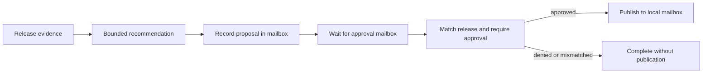

# The ALGAL process VM

ALGAL can run a bounded graph as a durable named process. A process records
its manifest, inputs, generation budget, checkpoint, and wake capabilities.
Each CLI invocation can exit; a later invocation verifies the checkpoint and
continues from its recorded effects. The durable state lives in the store,
not in a resident model conversation.

This is an application VM for typed agent programs. It does not emulate a
CPU, isolate an operating system, or turn a shell executor into a sandbox.
The host still owns admission, credentials, tools, and storage.

## Run the end-to-end demonstration

```sh
bun scripts/vm-demo.ts

# Cross-runtime handoff, using an already built native executable:
bun scripts/vm-demo.ts --native ./target/debug/algal

# Retain the stores, receipts, invocation logs, and a JSON report:
bun scripts/vm-demo.ts --native ./target/debug/algal --keep --out vm-report.json
```

The [demo script](../scripts/vm-demo.ts) starts a new OS process for every CLI
command. It creates its own
temporary stores and removes them after completion unless `--keep` is set.
There are no network actions or paid model calls.

The [release-review manifest](../examples/vm/release-review.algal.json)
implements a release report approval workflow:



A digest-linked wait organism takes both the receive capability and the
proposal's delivery ID. That dependency makes the proposal precede the wait;
it does not rely on incidental scheduling order. The model cell sees only
evidence. It receives no approval or publication capability, and its output
cannot itself approve the release. The host sends the approval message. The
final effect publishes a message to a local mailbox, not a production release.

## Measured behavior

A successful report checks the following results rather than printing
hard-coded success messages:

| Observation | Process VM | Fresh-run baseline |
| --- | ---: | ---: |
| Decision adapter invocations across two actors and their restarts | 2 | 4 |
| Additional decisions during resume | 0 | 2 |
| Proposal messages per actor | 1 | 1 |
| Approved / denied publication count | 1 / 0 | 1 / 0 |
| Idle scheduler ticks and decision calls | 0 / 0 | Not measured |
| Completed actor receipt generations verified offline | 4 | Not measured |

The baseline runs the same manifest and evidence from entry after the wake,
without its execution checkpoint. It retains the same idempotent mailbox
driver, so this comparison isolates repeated decision work. This is a naive
restart baseline, not a comparison against another durable workflow engine.
The adapter executes as a real subprocess and appends one log entry per
request, but returns a deterministic fixture response. Command adapters are
non-cacheable: this reuses a process checkpoint without enabling cross-run
effect memoization. Two avoided fixture
invocations demonstrate replay behavior; they are not model-quality, token,
latency, energy, or dollar measurements.

Two main actors share a manifest and evidence but have separate mailbox
capabilities: approving one leaves the other suspended, and denying the
second prevents publication. A separate scenario starts two process names
with byte-identical arguments, including shared capabilities. Both create a
distinct proposal; a single approval is consumed by exactly one actor. This
checks that process identity scopes effect idempotency while mailbox messages
still have one consumer.

The script sends each approval twice with the same explicit idempotency key.
It checks that the two sends return one delivery ID and that no second message
remains after consumption. It also compares the recorded recommendation and
proposal cells before and after resume, verifies every completed actor receipt
generation, and checks that verification did not invoke the adapter.

With `--native`, TypeScript creates and suspends one actor, then Rust resumes
it; Rust creates and suspends the other, then TypeScript resumes it. Both
runtimes verify both completed actor histories from the same filesystem store.
The identical-argument pair also starts in different runtimes and shares the
native scheduler, adding a third handoff while checking scoped write identity.
No network transport, cross-machine capability migration, or distributed
coordination is implied by this handoff.

## CLI and lifecycle

```sh
bun cli.ts process create review workflow.algal.json \
  --args review.args.json --modules examples/vm --max-generations 4 --dir .algal
bun cli.ts process tick review --executor-cmd 'your-adapter' --dir .algal
bun cli.ts process inspect review --dir .algal
bun cli.ts process schedule --max-ticks 8 --executor-cmd 'your-adapter' --dir .algal
bun cli.ts process list --dir .algal
bun cli.ts process verify review --dir .algal
```

`create` admits the manifest closure and fixes the name, arguments, and
maximum generation count. It starts at `ready`, generation zero. `tick`
records dispatch intent before entering the executor; a normal result becomes
`suspended`, `complete`, `failed`, or `stuck`. Every attempted generation
consumes one of the declared slots, including an unsuccessful explicit wake.

`schedule` makes one bounded pass in name order. It runs ready processes and
resumes suspended processes only when a recorded receive capability has a
pending mailbox message. It skips completed processes and waiting processes
with no message. It is a command that returns, not a resident background daemon.
An explicit `tick` can retry a suspended process without a ready wake and thus
consume another generation; normal polling should use `schedule`.

`create`, `tick`, and `inspect` return `{digest, process}`. `digest` addresses
the complete process record in `values/`. The record contains a `previous`
link through earlier state and dispatch intent. Its `receipt` addresses the
complete receipt JSON in `runs/`; this storage digest includes the receipt's
own intrinsic digest field, so the two digests have different meanings.
`verify` checks the record chain and replays all completed receipt generations
offline, returning `{ok, generations, receipts, digest}`. No live executor is
needed for verification.

## Failure boundary and current limits

A process that stops after dispatch intent and before recording its result
remains `uncertain`. Automatic scheduling does not retry it. Opt-in ordered
journals now support explicit same-intent recovery: completed effects replay,
unknown reads may be repeated within a budget, and unknown writes stop for
reconciliation. Both runtimes use an OS-released SQLite lease while retaining
legacy lock evidence. See the [recovery contract](../spec/v1/process-journal.md)
and run `bun scripts/recovery-demo.ts --native ./target/debug/algal`.

The [PR shepherd](pr-shepherd.md) is a practical host application: it collects
live exact-revision GitHub evidence, suspends on pending CI, and wakes from a
durable timer or deduplicated event. It produces review or repair packets with
no model calls in the waiting/readiness path. It currently performs read-only
GitHub work; durable external coding-job reconciliation remains future work.

Mailbox duplicate suppression applies to the supported durable mailbox
operations and their idempotency keys. Host tools must implement their own
idempotency and recovery semantics. ALGAL cannot guarantee exactly-once
arbitrary external effects across a crash. Command executors may exercise the
host process's full authority; `cwd`, ACP routing, type checking, and receipt
hashing do not provide OS isolation.

The [supervisor bounds](../src/process.ts) limit the process count to 1,024,
the generation count to 64, arguments
at 250,000 canonical bytes, and each receipt at 16,000,000 canonical bytes.
Per-run graph and mailbox bounds also apply. These are admission and execution
limits, not a store-wide disk quota. There is no distributed consensus,
network mailbox delivery, automatic capability transfer, or high-availability
service in this implementation.

Receipts establish consistency between recorded inputs, effects, and graph
execution under the admitted runtime. They do not attest that a provider was
contacted, establish the truth of model output, or authenticate an approver
beyond the host's control of the mailbox capability and storage.
