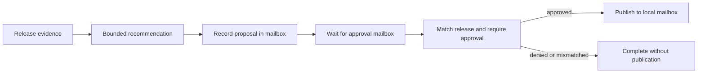

# The ALGAL process VM

For a one-binary hands-on tour with a passive HTML workbench and actual SIGKILL
proofs, start with [the native workbench](native-workbench.md).

ALGAL can run a bounded graph as a durable named process. A process records
its manifest, inputs, generation budget, checkpoint, and wake capabilities.
Each CLI invocation can exit; a later invocation verifies the checkpoint and
continues from its recorded effects. The durable state lives in the store,
not in a resident model conversation.

This is an application VM for typed agent programs. It does not emulate a
CPU, isolate an operating system, or turn a shell executor into a sandbox.
The host still owns admission, credentials, tools, and storage.

## Run the end-to-end demonstration

```sh
bun scripts/vm-demo.ts

# Cross-runtime handoff, using an already built native executable:
bun scripts/vm-demo.ts --native ./target/debug/algal

# Retain the stores, receipts, invocation logs, and a JSON report:
bun scripts/vm-demo.ts --native ./target/debug/algal --keep --out vm-report.json
```

The [demo script](../scripts/vm-demo.ts) starts a new OS process for every CLI
command. It creates its own
temporary stores and removes them after completion unless `--keep` is set.
There are no network actions or paid model calls.

The [release-review manifest](../examples/vm/release-review.algal.json)
implements a release report approval workflow:



A digest-linked wait organism takes both the receive capability and the
proposal's delivery ID. That dependency makes the proposal precede the wait;
it does not rely on incidental scheduling order. The model cell sees only
evidence. It receives no approval or publication capability, and its output
cannot itself approve the release. The host sends the approval message. The
final effect publishes a message to a local mailbox, not a production release.

## Measured behavior

A successful report checks the following results rather than printing
hard-coded success messages:

| Observation | Process VM | Fresh-run baseline |
| --- | ---: | ---: |
| Decision adapter invocations across two actors and their restarts | 2 | 4 |
| Additional decisions during resume | 0 | 2 |
| Proposal messages per actor | 1 | 1 |
| Approved / denied publication count | 1 / 0 | 1 / 0 |
| Idle scheduler ticks and decision calls | 0 / 0 | Not measured |
| Completed actor receipt generations verified offline | 4 | Not measured |

The baseline runs the same manifest and evidence from entry after the wake,
without its execution checkpoint. It retains the same idempotent mailbox
driver, so this comparison isolates repeated decision work. This is a naive
restart baseline, not a comparison against another durable workflow engine.
The adapter executes as a real subprocess and appends one log entry per
request, but returns a deterministic fixture response. Command adapters are
non-cacheable: this reuses a process checkpoint without enabling cross-run
effect memoization. Two avoided fixture
invocations demonstrate replay behavior; they are not model-quality, token,
latency, energy, or dollar measurements.

Two main actors share a manifest and evidence but have separate mailbox
capabilities: approving one leaves the other suspended, and denying the
second prevents publication. A separate scenario starts two process names
with byte-identical arguments, including shared capabilities. Both create a
distinct proposal; a single approval is consumed by exactly one actor. This
checks that process identity scopes effect idempotency while mailbox messages
still have one consumer.

The script sends each approval twice with the same explicit idempotency key.
It checks that the two sends return one delivery ID and that no second message
remains after consumption. It also compares the recorded recommendation and
proposal cells before and after resume, verifies every completed actor receipt
generation, and checks that verification did not invoke the adapter.

With `--native`, TypeScript creates and suspends one actor, then Rust resumes
it; Rust creates and suspends the other, then TypeScript resumes it. Both
runtimes verify both completed actor histories from the same filesystem store.
The identical-argument pair also starts in different runtimes and shares the
native scheduler, adding a third handoff while checking scoped write identity.
No network transport, cross-machine capability migration, or distributed
coordination is implied by this handoff.

## CLI and lifecycle

```sh
bun cli.ts process create review workflow.algal.json \
  --args review.args.json --modules examples/vm --max-generations 4 --dir .algal
bun cli.ts process tick review --executor-cmd 'your-adapter' --dir .algal
bun cli.ts process inspect review --dir .algal
bun cli.ts process schedule --max-ticks 8 --executor-cmd 'your-adapter' --dir .algal
bun cli.ts process list --dir .algal
bun cli.ts process verify review --dir .algal
```

`create` admits the manifest closure and fixes the name, arguments, and
maximum generation count. It starts at `ready`, generation zero. `tick`
records dispatch intent before entering the executor; a normal result becomes
`suspended`, `complete`, `failed`, or `stuck`. Every attempted generation
consumes one of the declared slots, including an unsuccessful explicit wake.

`schedule` makes one bounded pass in name order. It runs ready processes and
resumes suspended processes only when a recorded receive capability has a
pending mailbox message. It skips completed processes and waiting processes
with no message. It is a command that returns, not a resident background daemon.
An explicit `tick` can retry a suspended process without a ready wake and thus
consume another generation; normal polling should use `schedule`.

`create`, `tick`, and `inspect` return `{digest, process}`. `digest` addresses
the complete process record in `values/`. The record contains a `previous`
link through earlier state and dispatch intent. Its `receipt` addresses the
complete receipt JSON in `runs/`; this storage digest includes the receipt's
own intrinsic digest field, so the two digests have different meanings.
`verify` checks the record chain and replays all completed receipt generations
offline, returning `{ok, generations, receipts, digest}`. No live executor is
needed for verification.

## Observe a live store

```sh
algal observe --dir .algal
algal observe --dir .algal --follow --interval-ms 250 --max-polls 256
algal tail --dir .algal --max-events 512
```

`observe` prints one JSON snapshot of the store's current state. It exists so
an agent can watch running work rather than only replaying it afterwards. The
snapshot lists every process (name, status, generation, manifest digest, and
head record digest), each mailbox (pending deliveries, consumed count, message
count, and whether a send or receive holds its lock), capability records, host
events with their delivery status, application heads (state digest, sequence,
epoch, and revision), stored habitat accounts and schedules (totals, refusal
status, and activity outcomes), and a tail of run receipts. Store-wide counts
cover manifests, CAS values, runs, effects, and slots.

Every listing is `{items, total, truncated}` plus `{unreadable, foreign,
errors}`. `items` is the emitted page, `total` is the scanned count, and
`truncated` is true whenever a limit dropped entries. Records that fail to
parse or validate count toward `unreadable` (with the first eight failures
named in `errors`) instead of aborting the snapshot, and entries outside the
store layout count toward `foreign`. `--max-items` sizes each page, up to 256
(default 32); directory scans stop at 8192 entries, one record read is limited
to 4 MiB, and at most 16 pending deliveries are listed per mailbox.

Entries emit in a fixed order: processes, mailboxes, and applications by name;
capabilities, host events, habitat records, and runs by digest; then the
counter rows in sorted key order. The run tail is the highest digests in sorted
order, since the store carries no time field.

`--follow` (or the `tail` alias) re-reads the store on a host-side poll
interval and prints one JSON line per change. The first line is the initial
snapshot; each later line is one `{event: "change", sequence, section, key,
change, previous, value}` record where `previous` is the digest of the prior
projection; a final `{event: "end", reason, polls, emitted}` line reports why
the follow stopped. Changes emit in the snapshot's section order, each key at
most once per poll, and `sequence` increases monotonically. Follow stops at
`--max-polls` polls, `--max-events` emitted events, or an interrupt; the
interval is limited to 25 ms..60 s and each bound to 65536.

Observation is read-only: it takes no lease, acquires no lock, and never
writes. A snapshot can straddle a transition, so every emitted pointer is
re-read in a confirm pass at the end; an entry that moved between the two
reads reports `stable: false` and the snapshot reports `consistent: false`.
Emitted lines are deterministic functions of store state and carry no
wall-clock field; the poll interval lives only in the host loop.

Observation is implemented in the TypeScript runtime today. A native Rust
projection is proposed, not shipped.

## Verify a process away from its original host

```sh
algal process export review --dir .algal > review.evidence.json
# Copy just review.evidence.json to another machine with ALGAL installed:
algal process verify-evidence review.evidence.json

# Demonstrate this with a crash-recovered repair and both runtimes:
bun scripts/process-evidence-demo.ts --native ./target/debug/algal
```

Export packages the fixed process head, immutable history, replay dependencies,
and tool signatures into one bounded JSON file. The recipient can check every
completed generation with Bun or the standalone native binary. Verification
requires no original store, live adapter, credentials, or host configuration,
and creates no runnable process. The report includes the head digest, document
digest, retained status, and generation/receipt counts.

The demonstration repairs a failing scheduler through a deterministic durable
adapter, recovers after killing the caller, then exports the completed process.
It moves the original store, adapter and ledger away, runs fresh verifier
processes in an empty directory, rejects removed or forged history, and checks
that no host state was created or changed. Both runtimes verify both exports.

For custom tools, pass `--tools tools.json` during export; only signatures are
read. `verify-evidence` rejects host flags. Evidence preserves recorded prompts,
outputs, and capability strings, so review it before sharing. Replay establishes
internal consistency, not provider truth; an independently trusted digest is
needed to identify whose history was supplied. Host patch attachments, provider
ledgers, and execution custody are outside this format. See the
[portable evidence contract](../spec/v1/process-evidence.md).

## Counterfactual replay and ordering exploration

Because runs replay bit-for-bit, recorded history supports two further
questions as runtime operations, each producing a bounded, parseable record.

`algal replay <receipt.json> --with <manifest.json>` runs a revised manifest
against a recorded run's evidence: recorded effects answer while the revision
issues the recorded requests; after the trace diverges, requests the record
cannot answer reach the admitted live executors, exactly as a fresh run. The
emitted `algal.replay-comparison.v1` names the reproduced cell prefix in
recorded activation order, the first divergent cell path with both sides, the
final outcome comparison, and a verdict — `identical`, `diverged`, or
`could-not-replay` with an explicit reason (`manifest-invalid`,
`missing-input`, `missing-effect`). Nothing missing is fabricated. `--args`
merges overrides over the recorded args; `--write` persists the revised
receipt. `algal process replay <name> --with <manifest.json>` runs the same
comparison against a durable process's latest recorded run.

`algal ordering <scenario.json>` enumerates bounded mailbox/dispatch
orderings of a declared `algal.ordering-scenario.v1` setup — named mailboxes,
named processes, bounded external sends, an `algal.expr.v1` invariant over
`{"processes","mailboxes"}`, and limits. Every dispatch is charged to one
habitat budget account, so exhaustion is recorded rather than silent. The
`algal.ordering-report.v1` lists each ordering's actions and terminal state,
the first counterexample witness when an ordering fails the invariant, and an
outcome of `complete`, `counterexample`, or `exhausted`. Capability handles
derive deterministically from scenario names, so one scenario file reproduces
one report bit-for-bit.

Both features ship in the TypeScript reference runtime and the native kernel,
which emit identical records for the same inputs. See
the [replay and ordering contract](../spec/v1/replay.md).

## Failure boundary and current limits

A process that stops after dispatch intent and before recording its result
remains `uncertain`. Automatic scheduling does not retry it. Opt-in ordered
journals now support explicit same-intent recovery: completed effects replay,
unknown reads may be repeated within a budget, and unknown writes stop for
reconciliation. Both runtimes use an OS-released SQLite lease while retaining
legacy lock evidence. See the [recovery contract](../spec/v1/process-journal.md)
and run `bun scripts/recovery-demo.ts --native ./target/debug/algal`.

The [PR shepherd](pr-shepherd.md) is a practical host application: it collects
live exact-revision GitHub evidence, suspends on pending CI, and wakes from a
durable timer or deduplicated event. It produces review or repair packets with
no model calls in the waiting/readiness path. It currently performs read-only
GitHub work. The Bun coding-job host supports explicit reconciliation through
a qualified durable operation adapter; existing xcb v1 jobs do not expose that
operation lookup. Provider qualification and native host parity remain separate.

Mailbox duplicate suppression applies to the supported durable mailbox
operations and their idempotency keys. Host tools must implement their own
idempotency and recovery semantics. ALGAL cannot guarantee exactly-once
arbitrary external effects across a crash. Command executors may exercise the
host process's full authority; `cwd`, ACP routing, type checking, and receipt
hashing do not provide OS isolation.

The [supervisor bounds](../src/process.ts) limit the process count to 1,024,
the generation count to 64, arguments
at 250,000 canonical bytes, and each receipt at 16,000,000 canonical bytes.
Per-run graph and mailbox bounds also apply. These are admission and execution
limits, not a store-wide disk quota. There is no distributed consensus,
network mailbox delivery, automatic capability transfer, or high-availability
service in this implementation.

Receipts establish consistency between recorded inputs, effects, and graph
execution under the admitted runtime. They do not attest that a provider was
contacted, establish the truth of model output, or authenticate an approver
beyond the host's control of the mailbox capability and storage.

## Coding work with independent validation

The [repair workflow](repair.md) is a second practical VM application: suspend
until a host-owned coding job settles, then validate its retained patch with
fixed commands. The foreground job never automatically relaunches after an
uncertain result. The VM records check outcomes and both runtimes verify the
history offline. Native installation and supported targets are documented in
[the distribution guide](native-release.md).
